<header class="intro"><h1>50 Ways of Seeing</h1></header>

<section class="work" id="original" markdown="1">

Original

<!-- Write your museum reference notes here. -->

</section>

<section class="work" id="work-01" markdown="1">

<h2>01 / 50</h2>

<!-- Replace the placeholder below with your notes for work 01. -->

</section>

<section class="work" id="work-02" markdown="1">

<h2>02 / 50</h2>

<!-- Replace the placeholder below with your notes for work 02. -->

</section>

<section class="work" id="work-03" markdown="1">

<h2>03 / 50</h2>

<!-- Replace the placeholder below with your notes for work 03. -->

</section>

<section class="work" id="work-04" markdown="1">

<h2>04 / 50</h2>

<!-- Replace the placeholder below with your notes for work 04. -->

</section>

<section class="work" id="work-05" markdown="1">

<h2>05 / 50</h2>

<video id="video-5" class="artwork" controls playsinline preload="none" aria-label="Work 05 video">
  <source src="web/5-browser.mp4" type="video/mp4">
  <a href="web/5-browser.mp4">Download video</a>
</video>

<button type="button" data-video="video-5">Play video &amp; sound</button><a href="web/5-browser.mp4" target="_blank" rel="noopener">Open video</a>

<!-- Replace the placeholder below with your notes for work 05. -->

</section>

<section class="work" id="work-06" markdown="1">

<h2>06 / 50</h2>

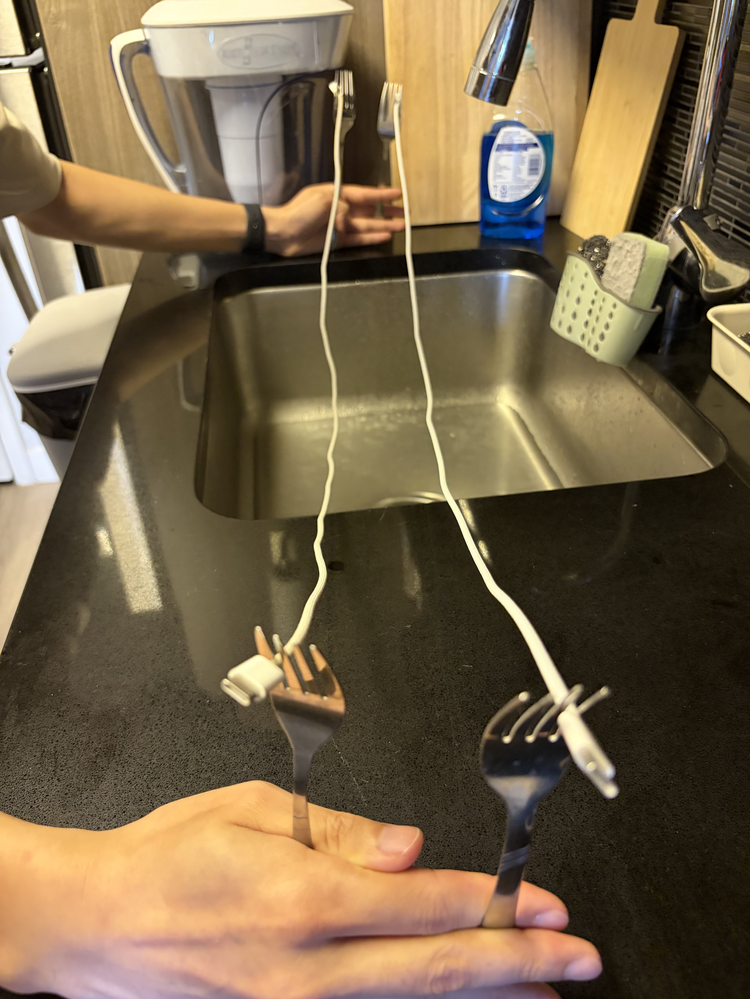

<!-- Replace the placeholder below with your notes for work 06. -->

</section>

<section class="work" id="work-07" markdown="1">

<h2>07 / 50</h2>

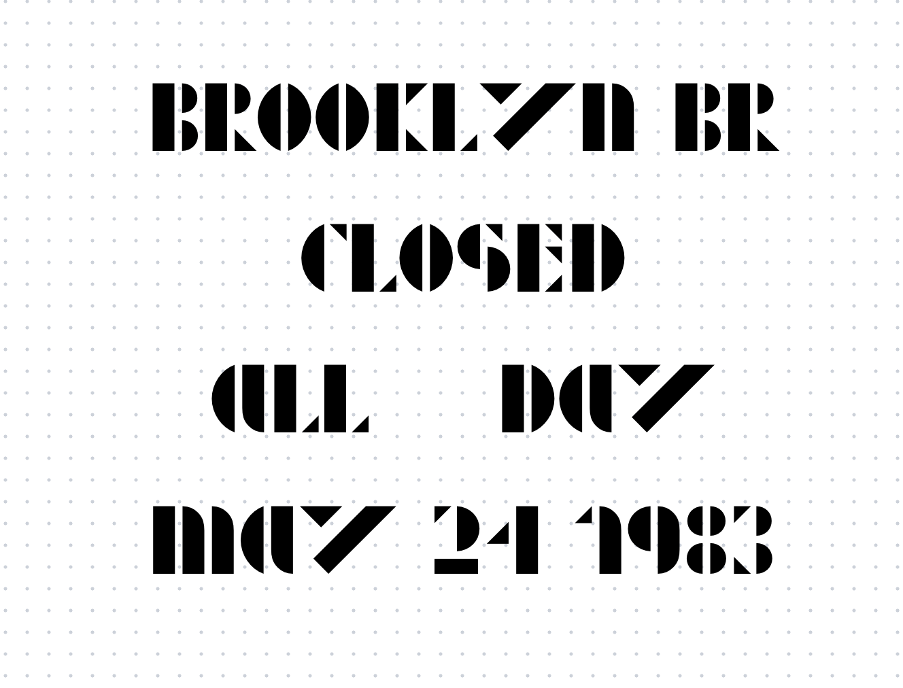

<!-- Replace the placeholder below with your notes for work 07. -->

</section>

<section class="work" id="work-08" markdown="1">

<h2>08 / 50</h2>

<!-- Replace the placeholder below with your notes for work 08. -->

</section>

<section class="work" id="work-09" markdown="1">

<h2>09 / 50</h2>

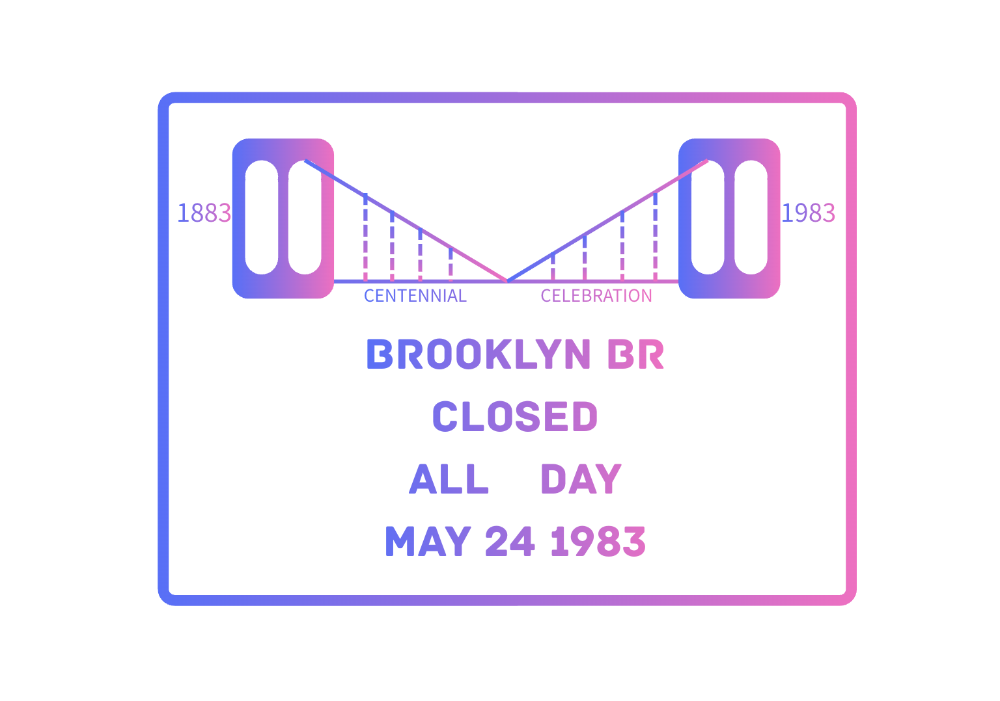

<!-- Replace the placeholder below with your notes for work 09. -->

</section>

<section class="work" id="work-10" markdown="1">

<h2>10 / 50</h2>

<!-- Replace the placeholder below with your notes for work 10. -->

</section>

<section class="work" id="work-11" markdown="1">

<h2>11 / 50</h2>

<!-- Replace the placeholder below with your notes for work 11. -->

</section>

<section class="work" id="work-12" markdown="1">

<h2>12 / 50</h2>

<!-- Replace the placeholder below with your notes for work 12. -->

</section>

<section class="work" id="work-13" markdown="1">

<h2>13 / 50</h2>

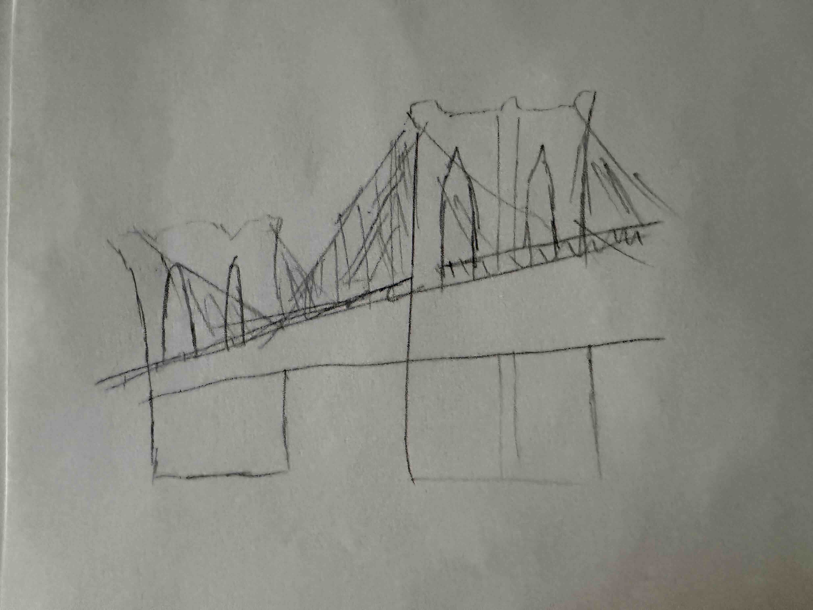

<!-- Replace the placeholder below with your notes for work 13. -->

</section>

<section class="work" id="work-14" markdown="1">

<h2>14 / 50</h2>

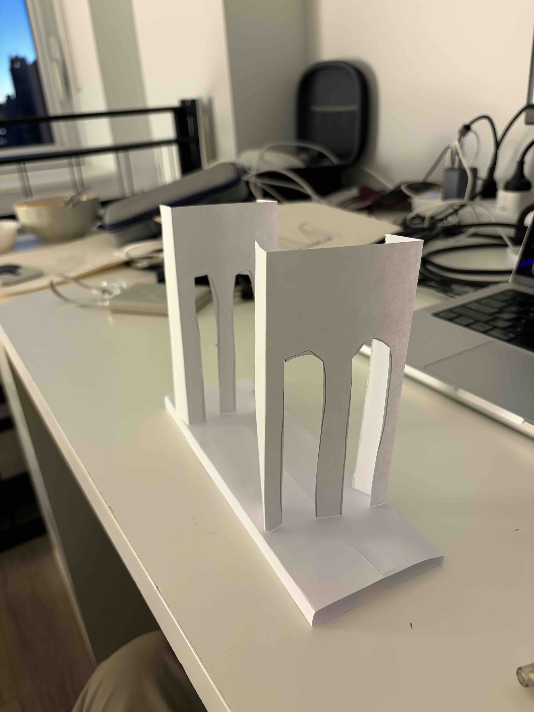

<!-- Replace the placeholder below with your notes for work 14. -->

</section>

<section class="work" id="work-15" markdown="1">

<h2>15 / 50</h2>

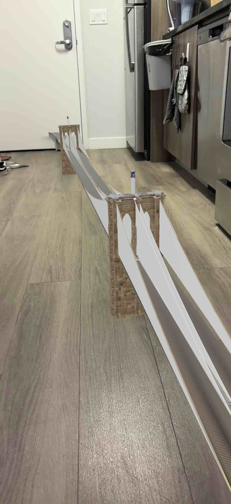

<!-- Replace the placeholder below with your notes for work 15. -->

</section>

<section class="work" id="work-16" markdown="1">

<h2>16 / 50</h2>

<!-- Replace the placeholder below with your notes for work 16. -->

</section>

<section class="work" id="work-17" markdown="1">

<h2>17 / 50</h2>

<!-- Replace the placeholder below with your notes for work 17. -->

</section>

<section class="work" id="work-18" markdown="1">

<h2>18 / 50</h2>

<!-- Replace the placeholder below with your notes for work 18. -->

</section>

<section class="work" id="work-19" markdown="1">

<h2>19 / 50</h2>

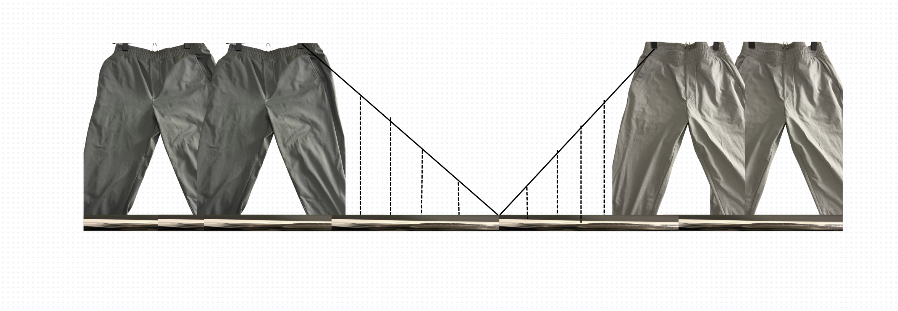

<!-- Replace the placeholder below with your notes for work 19. -->

</section>

<section class="work" id="work-20" markdown="1">

<h2>20 / 50</h2>

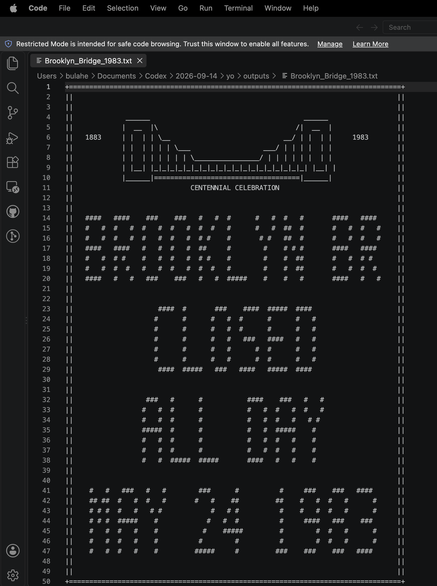

<!-- Replace the placeholder below with your notes for work 20. -->

</section>

<section class="work" id="work-21" markdown="1">

<h2>21 / 50</h2>

<video id="video-21" class="artwork" controls playsinline preload="none" aria-label="Work 21 video">
  <source src="web/21-browser.mp4" type="video/mp4">
  <a href="web/21-browser.mp4">Download video</a>
</video>

<button type="button" data-video="video-21">Play video</button><a href="web/21-browser.mp4" target="_blank" rel="noopener">Open video</a>

<!-- Replace the placeholder below with your notes for work 21. -->

</section>

<section class="work" id="work-22" markdown="1">

<h2>22 / 50</h2>

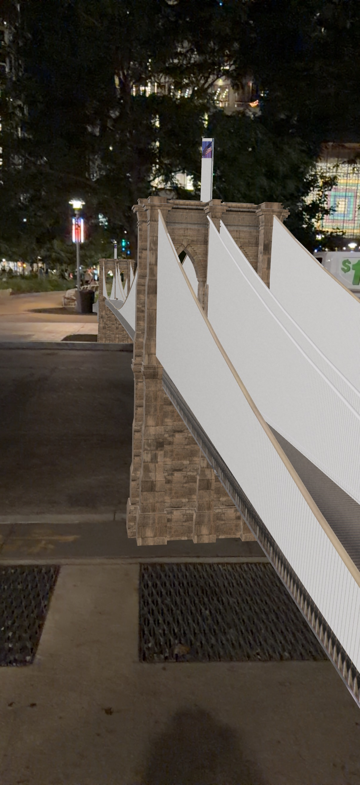

<!-- Replace the placeholder below with your notes for work 22. -->

</section>

<section class="work" id="work-23" markdown="1">

<h2>23 / 50</h2>

<!-- Replace the placeholder below with your notes for work 23. -->

</section>

<section class="work" id="work-24" markdown="1">

<h2>24 / 50</h2>

<!-- Replace the placeholder below with your notes for work 24. -->

</section>

<section class="work" id="work-25" markdown="1">

<h2>25 / 50</h2>

<!-- Replace the placeholder below with your notes for work 25. -->

</section>

<section class="work" id="work-26" markdown="1">

<h2>26 / 50</h2>

<!-- Replace the placeholder below with your notes for work 26. -->

</section>

<section class="work" id="work-27" markdown="1">

<h2>27 / 50</h2>

<!-- Replace the placeholder below with your notes for work 27. -->

</section>

<section class="work" id="work-28" markdown="1">

<h2>28 / 50</h2>

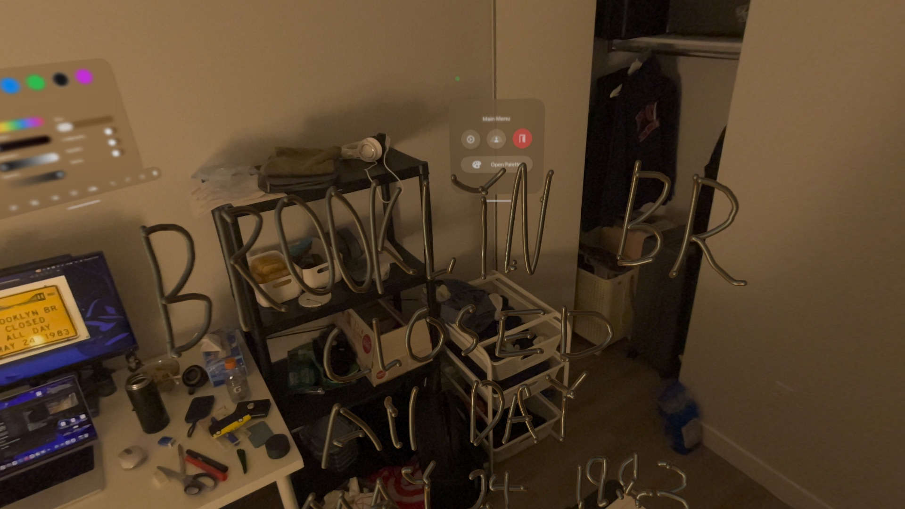

<!-- Replace the placeholder below with your notes for work 28. -->

</section>

<section class="work" id="work-29" markdown="1">

<h2>29 / 50</h2>

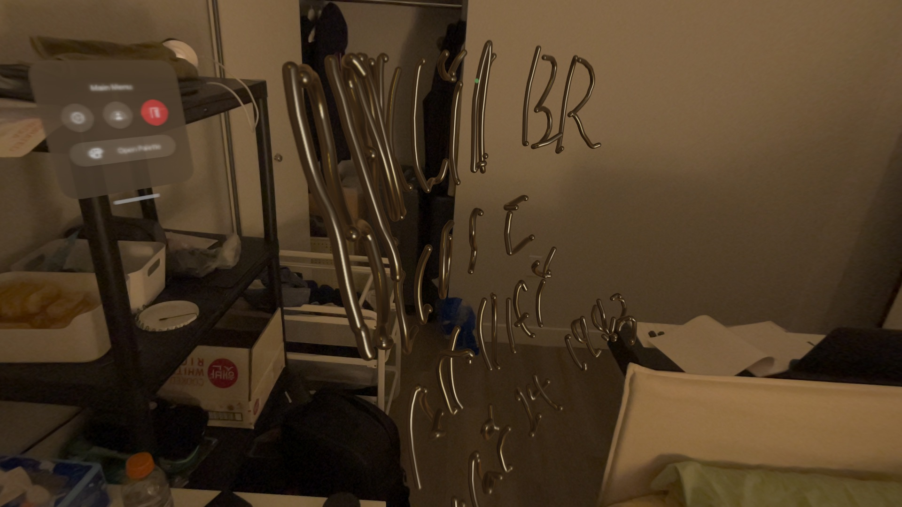

<!-- Replace the placeholder below with your notes for work 29. -->

</section>

<section class="work" id="work-30" markdown="1">

<h2>30 / 50</h2>

<!-- Replace the placeholder below with your notes for work 30. -->

</section>
