<section class="work" id="original" markdown="1">

Original

<!-- Write your museum reference notes here. -->
I found this original sign at the Center for Brooklyn History in Brooklyn Heights. It was made for the Brooklyn Bridge’s centennial celebration in 1983 and became the starting point for my 50 interpretations.

</section>

<!-- WORK 01 / 图片或视频放在上方，注释写在 notes 区域内。 -->
<section class="work" id="work-01" markdown="1">

<h2>01 / 50</h2>

<!-- Replace the placeholder below with your notes for work 01. -->
I implemented the first one by sketching with hands using pencil

</section>

<!-- WORK 02 / 图片或视频放在上方，注释写在 notes 区域内。 -->
<section class="work" id="work-02" markdown="1">

<h2>02 / 50</h2>

<!-- Replace the placeholder below with your notes for work 02. -->
Colored version

</section>

<!-- WORK 03 / 图片或视频放在上方，注释写在 notes 区域内。 -->
<section class="work" id="work-03" markdown="1">

<h2>03 / 50</h2>

<!-- Replace the placeholder below with your notes for work 03. -->
Canva version

</section>

<!-- WORK 04 / 图片或视频放在上方，注释写在 notes 区域内。 -->
<section class="work" id="work-04" markdown="1">

<h2>04 / 50</h2>

<!-- Replace the placeholder below with your notes for work 04. -->
When I was drawing the two arches of the Brooklyn Bridge, I found that the shape of it is similar with a slice of toast.

</section>

<!-- WORK 05 / 图片或视频放在上方，注释写在 notes 区域内。 -->
<section class="work" id="work-05" markdown="1">

<h2>05 / 50</h2>

<video id="video-5" class="artwork" controls playsinline preload="none" aria-label="Work 05 video">
  <source src="assets/video/5-browser.mp4" type="video/mp4">
  <a href="assets/video/5-browser.mp4">Download video</a>
</video>

<button type="button" data-video="video-5">Play video &amp; sound</button><a href="assets/video/5-browser.mp4" target="_blank" rel="noopener">Open video</a>

<!-- Replace the placeholder below with your notes for work 05. -->
I recreated the sign in Logic Pro using MIDI notes, turning its visual elements into sound.

</section>

<!-- WORK 06 / 图片或视频放在上方，注释写在 notes 区域内。 -->
<section class="work" id="work-06" markdown="1">

<h2>06 / 50</h2>

<!-- Replace the placeholder below with your notes for work 06. -->
Using forks and charing cables to represent the shape of Brooklyn Bridge

</section>

<!-- WORK 07 / 图片或视频放在上方，注释写在 notes 区域内。 -->
<section class="work" id="work-07" markdown="1">

<h2>07 / 50</h2>

<!-- Replace the placeholder below with your notes for work 07. -->
Canva version - changed font

</section>

<!-- WORK 08 / 图片或视频放在上方，注释写在 notes 区域内。 -->
<section class="work" id="work-08" markdown="1">

<h2>08 / 50</h2>

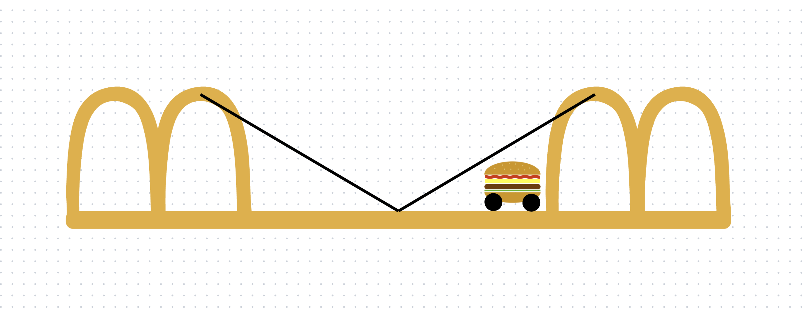

<!-- Replace the placeholder below with your notes for work 08. -->
The two arches reminded me of the McDonald’s logo.

</section>

<!-- WORK 09 / 图片或视频放在上方，注释写在 notes 区域内。 -->
<section class="work" id="work-09" markdown="1">

<h2>09 / 50</h2>

<!-- Replace the placeholder below with your notes for work 09. -->

</section>

<!-- WORK 10 / 图片或视频放在上方，注释写在 notes 区域内。 -->
<section class="work" id="work-10" markdown="1">

<h2>10 / 50</h2>

<!-- Replace the placeholder below with your notes for work 10. -->
Drawing the Brooklyn Bridge in one continuous line without lifting the pen.

</section>

<!-- WORK 11 / 图片或视频放在上方，注释写在 notes 区域内。 -->
<section class="work" id="work-11" markdown="1">

<h2>11 / 50</h2>

<!-- Replace the placeholder below with your notes for work 11. -->
Drawing the Brooklyn Bridge with only dots.

</section>

<!-- WORK 12 / 图片或视频放在上方，注释写在 notes 区域内。 -->
<section class="work" id="work-12" markdown="1">

<h2>12 / 50</h2>

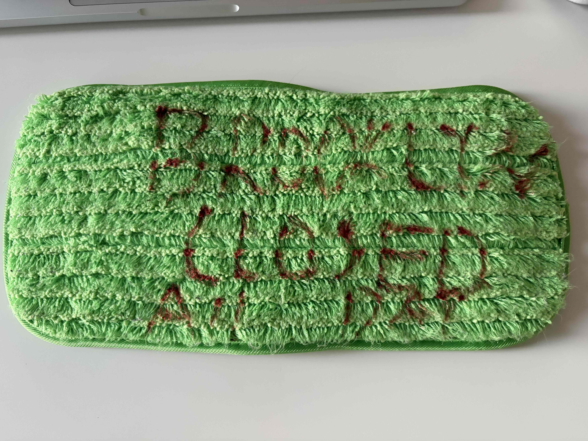

<!-- Replace the placeholder below with your notes for work 12. -->
Drawing on mop pad.

</section>

<!-- WORK 13 / 图片或视频放在上方，注释写在 notes 区域内。 -->
<section class="work" id="work-13" markdown="1">

<h2>13 / 50</h2>

<!-- Replace the placeholder below with your notes for work 13. -->
Hand-drawn Brooklyn Bridge another view 3D.

</section>

<!-- WORK 14 / 图片或视频放在上方，注释写在 notes 区域内。 -->
<section class="work" id="work-14" markdown="1">

<h2>14 / 50</h2>

<!-- Replace the placeholder below with your notes for work 14. -->
3D Brooklyn Bridge made by paper.

</section>

<!-- WORK 15 / 图片或视频放在上方，注释写在 notes 区域内。 -->
<section class="work" id="work-15" markdown="1">

<h2>15 / 50</h2>

<!-- Replace the placeholder below with your notes for work 15. -->
Then I started to think which else can I explore. So I tried augmented reality.

</section>

<!-- WORK 16 / 图片或视频放在上方，注释写在 notes 区域内。 -->
<section class="work" id="work-16" markdown="1">

<h2>16 / 50</h2>

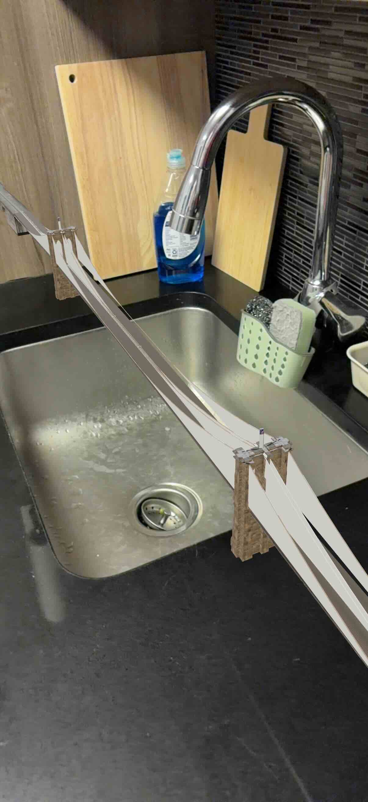

<!-- Replace the placeholder below with your notes for work 16. -->

</section>

<!-- WORK 17 / 图片或视频放在上方，注释写在 notes 区域内。 -->
<section class="work" id="work-17" markdown="1">

<h2>17 / 50</h2>

<!-- Replace the placeholder below with your notes for work 17. -->

</section>

<!-- WORK 18 / 图片或视频放在上方，注释写在 notes 区域内。 -->
<section class="work" id="work-18" markdown="1">

<h2>18 / 50</h2>

<!-- Replace the placeholder below with your notes for work 18. -->
Wanting to use pants to represents the two arches, guess I failed.

</section>

<!-- WORK 19 / 图片或视频放在上方，注释写在 notes 区域内。 -->
<section class="work" id="work-19" markdown="1">

<h2>19 / 50</h2>

<!-- Replace the placeholder below with your notes for work 19. -->
pants plan in 2d kinda work!

</section>

<!-- WORK 20 / 图片或视频放在上方，注释写在 notes 区域内。 -->
<section class="work" id="work-20" markdown="1">

<h2>20 / 50</h2>

<!-- Replace the placeholder below with your notes for work 20. -->
The original sign replicated in txt file!

</section>

<!-- WORK 21 / 图片或视频放在上方，注释写在 notes 区域内。 -->
<section class="work" id="work-21" markdown="1">

<h2>21 / 50</h2>

<video id="video-21" class="artwork" controls playsinline preload="none" aria-label="Work 21 video">
  <source src="assets/video/21-browser.mp4" type="video/mp4">
  <a href="assets/video/21-browser.mp4">Download video</a>
</video>

<button type="button" data-video="video-21">Play video</button><a href="assets/video/21-browser.mp4" target="_blank" rel="noopener">Open video</a>

<!-- Replace the placeholder below with your notes for work 21. -->
Out of idea now, so I went to the physical Brooklyn Bridge for inspiration. The sound of the Brooklyn Bridge.

</section>

<!-- WORK 22 / 图片或视频放在上方，注释写在 notes 区域内。 -->
<section class="work" id="work-22" markdown="1">

<h2>22 / 50</h2>

<!-- Replace the placeholder below with your notes for work 22. -->
AR Brooklyn Bridge across the road.

</section>

<!-- WORK 23 / 图片或视频放在上方，注释写在 notes 区域内。 -->
<section class="work" id="work-23" markdown="1">

<h2>23 / 50</h2>

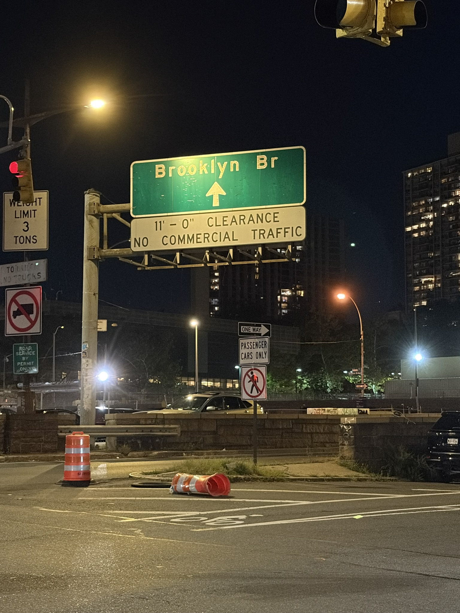

<!-- Replace the placeholder below with your notes for work 23. -->
Brooklyn Bridge sign on the actual road

</section>

<!-- WORK 24 / 图片或视频放在上方，注释写在 notes 区域内。 -->
<section class="work" id="work-24" markdown="1">

<h2>24 / 50</h2>

<!-- Replace the placeholder below with your notes for work 24. -->

</section>

<!-- WORK 25 / 图片或视频放在上方，注释写在 notes 区域内。 -->
<section class="work" id="work-25" markdown="1">

<h2>25 / 50</h2>

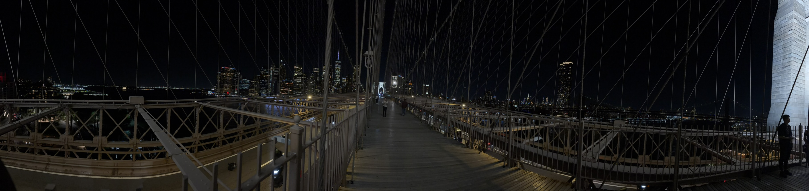

<!-- Replace the placeholder below with your notes for work 25. -->

</section>

<!-- WORK 26 / 图片或视频放在上方，注释写在 notes 区域内。 -->
<section class="work" id="work-26" markdown="1">

<h2>26 / 50</h2>

<!-- Replace the placeholder below with your notes for work 26. -->
The Brooklyn Bridge wasn’t closed, but I did find something locked.

</section>

<!-- WORK 27 / 图片或视频放在上方，注释写在 notes 区域内。 -->
<section class="work" id="work-27" markdown="1">

<h2>27 / 50</h2>

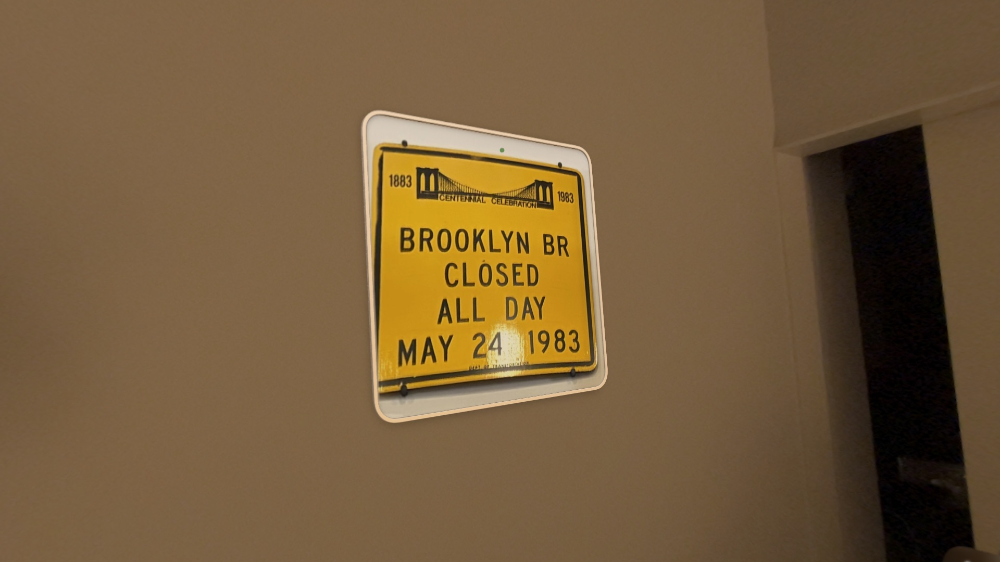

<!-- Replace the placeholder below with your notes for work 27. -->
The original sign viewed in AR

</section>

<!-- WORK 28 / 图片或视频放在上方，注释写在 notes 区域内。 -->
<section class="work" id="work-28" markdown="1">

<h2>28 / 50</h2>

<!-- Replace the placeholder below with your notes for work 28. -->
AR 3D drawing recreated the sign

</section>

<!-- WORK 29 / 图片或视频放在上方，注释写在 notes 区域内。 -->
<section class="work" id="work-29" markdown="1">

<h2>29 / 50</h2>

<!-- Replace the placeholder below with your notes for work 29. -->

</section>

<!-- WORK 30 / 图片或视频放在上方，注释写在 notes 区域内。 -->
<section class="work" id="work-30" markdown="1">

<h2>30 / 50</h2>

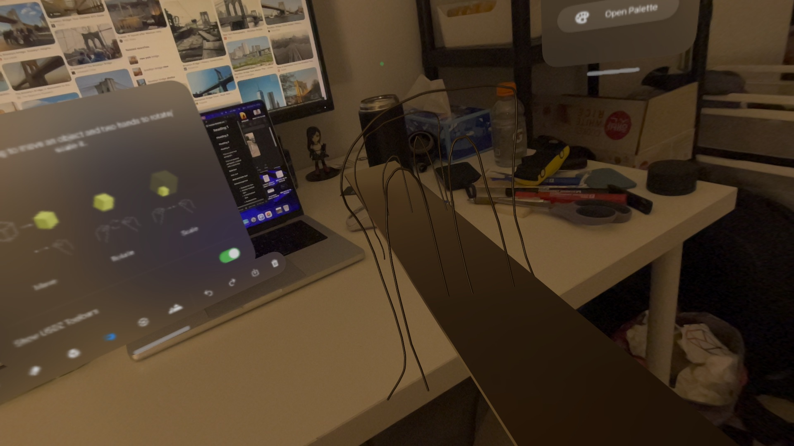

<!-- Replace the placeholder below with your notes for work 30. -->
AR 3D drawing recreated the Brooklyn bridge

</section>

<!-- WORK 31 / 搜索这个编号即可找到上传和注释位置。 -->
<section class="work" id="work-31" markdown="1">

<h2>31 / 50</h2>

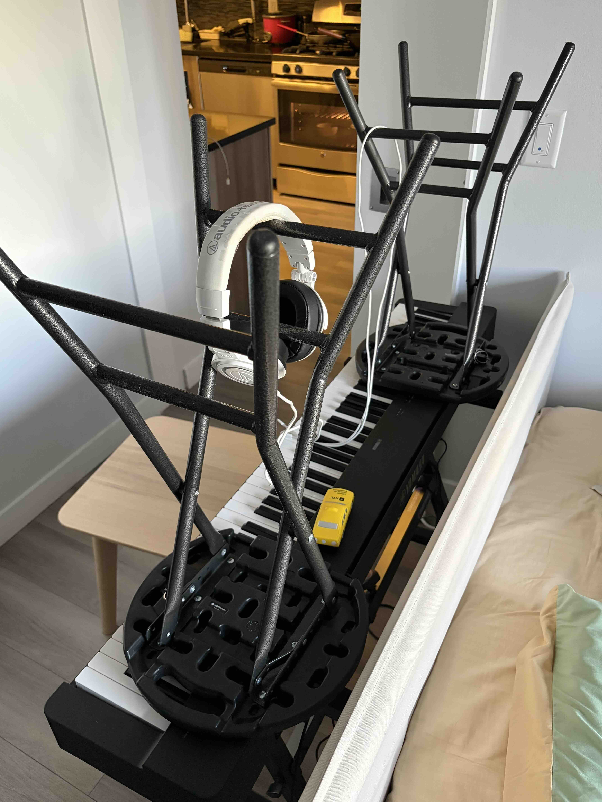

<!-- 在下面空行写第 31 件作品的注释；留空则不显示。 -->
recreating the Brooklyn Bridge using my electric piano and foldable chairs.

</section>

<!-- WORK 32 / 搜索这个编号即可找到上传和注释位置。 -->
<section class="work" id="work-32" markdown="1">

<h2>32 / 50</h2>

When I was making breakfast, the color of plain omelet reminded me of the sign.
 

<!-- 在下面空行写第 32 件作品的注释；留空则不显示。 -->
BRK BR CLOSED ALL DAY.

</section>

<!-- WORK 33 / 搜索这个编号即可找到上传和注释位置。 -->
<section class="work" id="work-33" markdown="1">

<h2>33 / 50</h2>

Flipped it over and tried another way to paint with ketchup.

<!-- 在下面空行写第 33 件作品的注释；留空则不显示。 -->
BRK BR CLOSED FOR BF   (Brooklyn Bridge Closed for Breakfast)

</section>

<!-- WORK 34 / 搜索这个编号即可找到上传和注释位置。 -->
<section class="work" id="work-34" markdown="1">

<h2>34 / 50</h2>

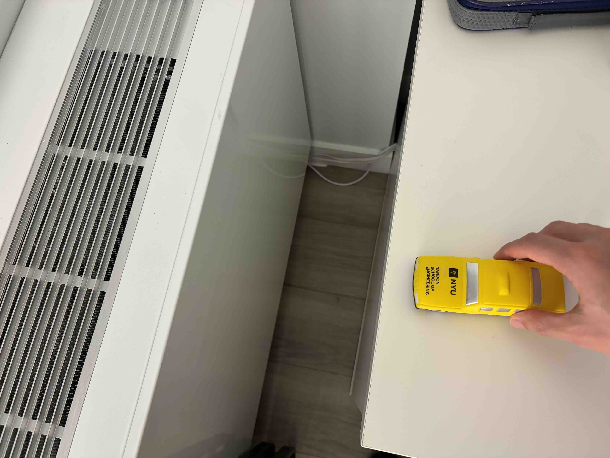

<!-- 在下面空行写第 34 件作品的注释；留空则不显示。 -->
Closed

</section>

<!-- WORK 35 / 搜索这个编号即可找到上传和注释位置。 -->
<section class="work" id="work-35" markdown="1">

<h2>35 / 50</h2>

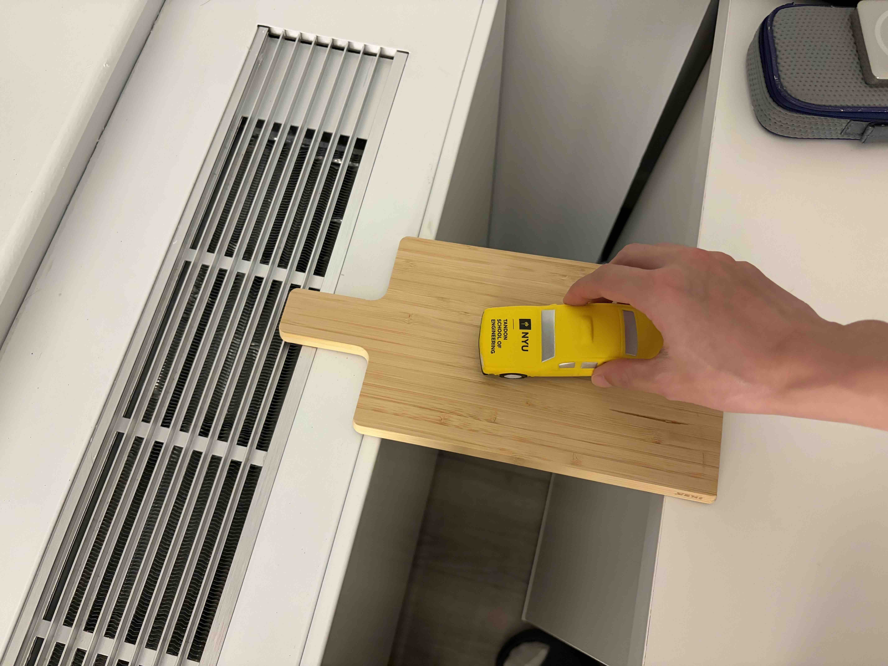

<!-- 在下面空行写第 35 件作品的注释；留空则不显示。 -->
Opened

</section>

<!-- WORK 36 / 搜索这个编号即可找到上传和注释位置。 -->
<section class="work" id="work-36" markdown="1">

<h2>36 / 50</h2>

<!-- 在下面空行写第 36 件作品的注释；留空则不显示。 -->
How the Brooklyn Bridge might tell us it’s closed nowadays.

</section>

<!-- WORK 37 / 搜索这个编号即可找到上传和注释位置。 -->
<section class="work" id="work-37" markdown="1">

<h2>37 / 50</h2>

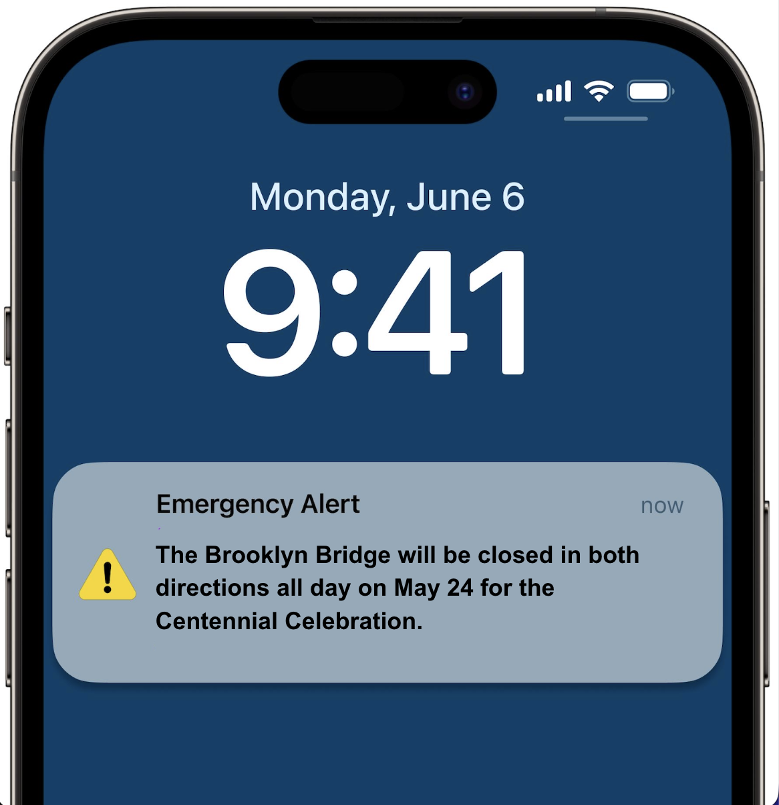

<!-- 在下面空行写第 37 件作品的注释；留空则不显示。 -->

</section>

<!-- WORK 38 / 搜索这个编号即可找到上传和注释位置。 -->
<section class="work" id="work-38" markdown="1">

<h2>38 / 50</h2>

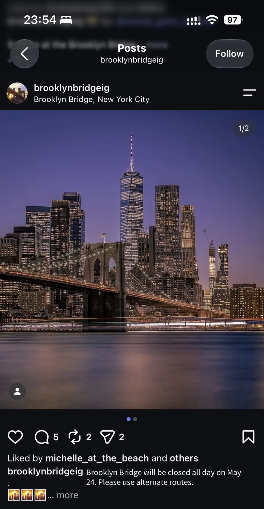

<!-- 在下面空行写第 38 件作品的注释；留空则不显示。 -->

</section>

<!-- WORK 39 / 搜索这个编号即可找到上传和注释位置。 -->
<section class="work" id="work-39" markdown="1">

<h2>39 / 50</h2>

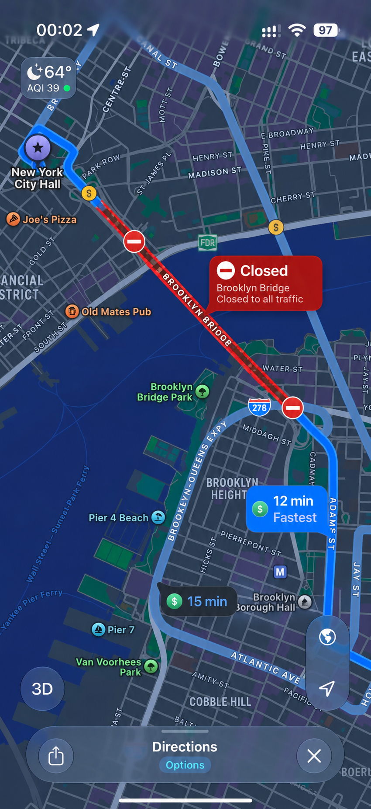

<!-- 在下面空行写第 39 件作品的注释；留空则不显示。 -->

</section>

<!-- WORK 40 / 搜索这个编号即可找到上传和注释位置。 -->
<section class="work" id="work-40" markdown="1">

<h2>40 / 50</h2>

I’ve explored the sign and the shape of the bridge. Now it’s time to explore its history and celebration.

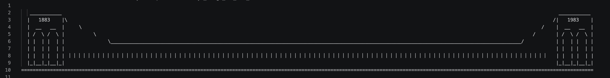

<!-- 在下面空行写第 40 件作品的注释；留空则不显示。 -->
I turned the Brooklyn Bridge into a timeline from 1883 to 1983, using 100 vertical lines across the bridge to represent its 100 years of history.

</section>

<!-- WORK 41 / 搜索这个编号即可找到上传和注释位置。 -->
<section class="work" id="work-41" markdown="1">

<h2>41 / 50</h2>

<!-- 上传 41.jpg 到 50ways/assets/images 文件夹后，删除下面图片代码两侧的注释符号即可显示。

-->
M_______________M

<!-- 在下面空行写第 41 件作品的注释；留空则不显示。 -->
minimal Brooklyn Bridge.

</section>

<!-- WORK 42 / 搜索这个编号即可找到上传和注释位置。 -->
<section class="work" id="work-42" markdown="1">

<h2>42 / 50</h2>

<!-- 在下面空行写第 42 件作品的注释；留空则不显示。 -->

</section>

<!-- WORK 43 / 搜索这个编号即可找到上传和注释位置。 -->
<section class="work" id="work-43" markdown="1">

<h2>43 / 50</h2>

<!-- 在下面空行写第 43 件作品的注释；留空则不显示。 -->
Brooklyn Bridge's birthday cake

</section>

<!-- WORK 44 / 搜索这个编号即可找到上传和注释位置。 -->
<section class="work" id="work-44" markdown="1">

<h2>44 / 50</h2>

  BROOKLYN BR 
  CLOSED 
  ALL DAY 
  MAY 24 1983

<!-- 上传 44.jpg 到 50ways/assets/images 文件夹后，删除下面图片代码两侧的注释符号即可显示。

-->

<!-- 在下面空行写第 44 件作品的注释；留空则不显示。 -->

</section>

<!-- WORK 45 / 搜索这个编号即可找到上传和注释位置。 -->
<section class="work" id="work-45" markdown="1">

<h2>45 / 50</h2>

BROOKLYN BR CLOSED ALL DAY MAY 24 1983 BROOKLYN BR CLOSED ALL DAY MAY 24 1983 BROOKLYN BR CLOSED ALL DAY MAY 24 1983 BROOKLYN BR CLOSED ALL DAY MAY 24 1983 BROOKLYN BR CLOSED ALL DAY MAY 24 1983 BROOKLYN BR CLOSED ALL DAY MAY 24 1983 BROOKLYN BR CLOSED ALL DAY MAY 24 1983 BROOKLYN BR CLOSED ALL DAY MAY 24 1983 BROOKLYN BR CLOSED ALL DAY MAY 24 1983 BROOKLYN BR CLOSED ALL DAY MAY 24 1983 BROOKLYN BR CLOSED ALL DAY MAY 24 1983 BROOKLYN BR CLOSED ALL DAY MAY 24 1983 BROOKLYN BR CLOSED ALL DAY MAY 24 1983 BROOKLYN BR CLOSED ALL DAY MAY 24 1983 BROOKLYN BR CLOSED ALL DAY MAY 24 1983 BROOKLYN BR CLOSED ALL DAY MAY 24 1983 BROOKLYN BR CLOSED ALL DAY MAY 24 1983 BROOKLYN BR CLOSED ALL DAY MAY 24 1983 BROOKLYN BR CLOSED ALL DAY MAY 24 1983 BROOKLYN BR CLOSED ALL DAY MAY 24 1983 BROOKLYN BR CLOSED ALL DAY MAY 24 1983 BROOKLYN BR CLOSED ALL DAY MAY 24 1983  BROOKLYN BR CLOSED ALL DAY MAY 24 1983 BROOKLYN BR CLOSED ALL DAY MAY 24 1983 BROOKLYN BR CLOSED ALL DAY MAY 24 1983 BROOKLYN BR CLOSED ALL DAY MAY 24 1983 BROOKLYN BR CLOSED ALL DAY MAY 24 1983 BROOKLYN BR CLOSED ALL DAY MAY 24 1983 BROOKLYN BR CLOSED ALL DAY MAY 24 1983 BROOKLYN BR CLOSED ALL DAY MAY 24 1983 BROOKLYN BR CLOSED ALL DAY MAY 24 1983 BROOKLYN BR CLOSED ALL DAY MAY 24 1983 BROOKLYN BR CLOSED ALL DAY MAY 24 1983  BROOKLYN BR CLOSED ALL DAY MAY 24 1983 BROOKLYN BR CLOSED ALL DAY MAY 24 1983 BROOKLYN BR CLOSED ALL DAY MAY 24 1983 BROOKLYN BR CLOSED ALL DAY MAY 24 1983 BROOKLYN BR CLOSED ALL DAY MAY 24 1983 BROOKLYN BR CLOSED ALL DAY MAY 24 1983 BROOKLYN BR CLOSED ALL DAY MAY 24 1983 BROOKLYN BR CLOSED ALL DAY MAY 24 1983 BROOKLYN BR CLOSED ALL DAY MAY 24 1983 BROOKLYN BR CLOSED ALL DAY MAY 24 1983 BROOKLYN BR CLOSED ALL DAY MAY 24 1983  BROOKLYN BR CLOSED ALL DAY MAY 24 1983 BROOKLYN BR CLOSED ALL DAY MAY 24 1983 BROOKLYN BR CLOSED ALL DAY MAY 24 1983 BROOKLYN BR CLOSED ALL DAY MAY 24 1983 BROOKLYN BR CLOSED ALL DAY MAY 24 1983 BROOKLYN BR CLOSED ALL DAY MAY 24 1983 BROOKLYN BR CLOSED ALL DAY MAY 24 1983 BROOKLYN BR CLOSED ALL DAY MAY 24 1983 BROOKLYN BR CLOSED ALL DAY MAY 24 1983 BROOKLYN BR CLOSED ALL DAY MAY 24 1983 BROOKLYN BR CLOSED ALL DAY MAY 24 1983  BROOKLYN BR CLOSED ALL DAY MAY 24 1983 BROOKLYN BR CLOSED ALL DAY MAY 24 1983 BROOKLYN BR CLOSED ALL DAY MAY 24 1983 BROOKLYN BR CLOSED ALL DAY MAY 24 1983 BROOKLYN BR CLOSED ALL DAY MAY 24 1983 BROOKLYN BR CLOSED ALL DAY MAY 24 1983 BROOKLYN BR CLOSED ALL DAY MAY 24 1983 BROOKLYN BR CLOSED ALL DAY MAY 24 1983 BROOKLYN BR CLOSED ALL DAY MAY 24 1983 BROOKLYN BR CLOSED ALL DAY MAY 24 1983 BROOKLYN BR CLOSED ALL DAY MAY 24 1983  BROOKLYN BR CLOSED ALL DAY MAY 24 1983 BROOKLYN BR CLOSED ALL DAY MAY 24 1983 BROOKLYN BR CLOSED ALL DAY MAY 24 1983 BROOKLYN BR CLOSED ALL DAY MAY 24 1983 BROOKLYN BR CLOSED ALL DAY MAY 24 1983 BROOKLYN BR CLOSED ALL DAY MAY 24 1983 BROOKLYN BR CLOSED ALL DAY MAY 24 1983 BROOKLYN BR CLOSED ALL DAY MAY 24 1983 BROOKLYN BR CLOSED ALL DAY MAY 24 1983 BROOKLYN BR CLOSED ALL DAY MAY 24 1983 BROOKLYN BR CLOSED ALL DAY MAY 24 1983 BROOKLYN BR CLOSED ALL DAY MAY 24 1983 BROOKLYN BR CLOSED ALL DAY MAY 24 1983 BROOKLYN BR CLOSED ALL DAY MAY 24 1983 BROOKLYN BR CLOSED ALL DAY MAY 24 1983 BROOKLYN BR CLOSED ALL DAY MAY 24 1983 BROOKLYN BR CLOSED ALL DAY MAY 24 1983 BROOKLYN BR CLOSED ALL DAY MAY 24 1983 BROOKLYN BR CLOSED ALL DAY MAY 24 1983 BROOKLYN BR CLOSED ALL DAY MAY 24 1983 BROOKLYN BR CLOSED ALL DAY MAY 24 1983 BROOKLYN BR CLOSED ALL DAY MAY 24 1983 
BROOKLYN BR CLOSED ALL DAY MAY 24 1983 BROOKLYN BR CLOSED ALL DAY MAY 24 1983 BROOKLYN BR CLOSED ALL DAY MAY 24 1983 BROOKLYN BR CLOSED ALL DAY MAY 24 1983 BROOKLYN BR CLOSED ALL DAY MAY 24 1983 BROOKLYN BR CLOSED ALL DAY MAY 24 1983 BROOKLYN BR CLOSED ALL DAY MAY 24 1983 BROOKLYN BR CLOSED ALL DAY MAY 24 1983 BROOKLYN BR CLOSED ALL DAY MAY 24 1983 BROOKLYN BR CLOSED ALL DAY MAY 24 1983 BROOKLYN BR CLOSED ALL DAY MAY 24 1983 BROOKLYN BR CLOSED ALL DAY MAY 24 1983 BROOKLYN BR CLOSED ALL DAY MAY 24 1983 BROOKLYN BR CLOSED ALL DAY MAY 24 1983 BROOKLYN BR CLOSED ALL DAY MAY 24 1983 BROOKLYN BR CLOSED ALL DAY MAY 24 1983 BROOKLYN BR CLOSED ALL DAY MAY 24 1983 BROOKLYN BR CLOSED ALL DAY MAY 24 1983 BROOKLYN BR CLOSED ALL DAY MAY 24 1983 BROOKLYN BR CLOSED ALL DAY MAY 24 1983 BROOKLYN BR CLOSED ALL DAY MAY 24 1983 BROOKLYN BR CLOSED ALL DAY MAY 24 1983  BROOKLYN BR CLOSED ALL DAY MAY 24 1983 BROOKLYN BR CLOSED ALL DAY MAY 24 1983 BROOKLYN BR CLOSED ALL DAY MAY 24 1983 BROOKLYN BR CLOSED ALL DAY MAY 24 1983 BROOKLYN BR CLOSED ALL DAY MAY 24 1983 BROOKLYN BR CLOSED ALL DAY MAY 24 1983 BROOKLYN BR CLOSED ALL DAY MAY 24 1983 BROOKLYN BR CLOSED ALL DAY MAY 24 1983 BROOKLYN BR CLOSED ALL DAY MAY 24 1983 BROOKLYN BR CLOSED ALL DAY MAY 24 1983 BROOKLYN BR CLOSED ALL DAY MAY 24 1983  BROOKLYN BR CLOSED ALL DAY MAY 24 1983 BROOKLYN BR CLOSED ALL DAY MAY 24 1983 BROOKLYN BR CLOSED ALL DAY MAY 24 1983 BROOKLYN BR CLOSED ALL DAY MAY 24 1983 BROOKLYN BR CLOSED ALL DAY MAY 24 1983 BROOKLYN BR CLOSED ALL DAY MAY 24 1983 BROOKLYN BR CLOSED ALL DAY MAY 24 1983 BROOKLYN BR CLOSED ALL DAY MAY 24 1983 BROOKLYN BR CLOSED ALL DAY MAY 24 1983 BROOKLYN BR CLOSED ALL DAY MAY 24 1983 BROOKLYN BR CLOSED ALL DAY MAY 24 1983  BROOKLYN BR CLOSED ALL DAY MAY 24 1983 BROOKLYN BR CLOSED ALL DAY MAY 24 1983 BROOKLYN BR CLOSED ALL DAY MAY 24 1983 BROOKLYN BR CLOSED ALL DAY MAY 24 1983 BROOKLYN BR CLOSED ALL DAY MAY 24 1983 BROOKLYN BR CLOSED ALL DAY MAY 24 1983 BROOKLYN BR CLOSED ALL DAY MAY 24 1983 BROOKLYN BR CLOSED ALL DAY MAY 24 1983 BROOKLYN BR CLOSED ALL DAY MAY 24 1983 BROOKLYN BR CLOSED ALL DAY MAY 24 1983 BROOKLYN BR CLOSED ALL DAY MAY 24 1983  BROOKLYN BR CLOSED ALL DAY MAY 24 1983 BROOKLYN BR CLOSED ALL DAY MAY 24 1983 BROOKLYN BR CLOSED ALL DAY MAY 24 1983 BROOKLYN BR CLOSED ALL DAY MAY 24 1983 BROOKLYN BR CLOSED ALL DAY MAY 24 1983 BROOKLYN BR CLOSED ALL DAY MAY 24 1983 BROOKLYN BR CLOSED ALL DAY MAY 24 1983 BROOKLYN BR CLOSED ALL DAY MAY 24 1983 BROOKLYN BR CLOSED ALL DAY MAY 24 1983 BROOKLYN BR CLOSED ALL DAY MAY 24 1983 BROOKLYN BR CLOSED ALL DAY MAY 24 1983  BROOKLYN BR CLOSED ALL DAY MAY 24 1983 BROOKLYN BR CLOSED ALL DAY MAY 24 1983 BROOKLYN BR CLOSED ALL DAY MAY 24 1983 BROOKLYN BR CLOSED ALL DAY MAY 24 1983 BROOKLYN BR CLOSED ALL DAY MAY 24 1983 BROOKLYN BR CLOSED ALL DAY MAY 24 1983 BROOKLYN BR CLOSED ALL DAY MAY 24 1983 BROOKLYN BR CLOSED ALL DAY MAY 24 1983 BROOKLYN BR CLOSED ALL DAY MAY 24 1983 BROOKLYN BR CLOSED ALL DAY MAY 24 1983 BROOKLYN BR CLOSED ALL DAY MAY 24 1983 BROOKLYN BR CLOSED ALL DAY MAY 24 1983 BROOKLYN BR CLOSED ALL DAY MAY 24 1983 BROOKLYN BR CLOSED ALL DAY MAY 24 1983 BROOKLYN BR CLOSED ALL DAY MAY 24 1983 BROOKLYN BR CLOSED ALL DAY MAY 24 1983 BROOKLYN BR CLOSED ALL DAY MAY 24 1983 BROOKLYN BR CLOSED ALL DAY MAY 24 1983 BROOKLYN BR CLOSED ALL DAY MAY 24 1983 BROOKLYN BR CLOSED ALL DAY MAY 24 1983 BROOKLYN BR CLOSED ALL DAY MAY 24 1983 BROOKLYN BR CLOSED ALL DAY MAY 24 1983 
<!-- 上传 45.jpg 到 50ways/assets/images 文件夹后，删除下面图片代码两侧的注释符号即可显示。

-->

<!-- 在下面空行写第 45 件作品的注释；留空则不显示。 -->

</section>

<!-- WORK 46 / 搜索这个编号即可找到上传和注释位置。 -->
<section class="work" id="work-46" markdown="1">

<h2>46 / 50</h2>

CLOSED

<!-- 在下面空行写第 46 件作品的注释；留空则不显示。 -->

</section>

<!-- WORK 47 / 搜索这个编号即可找到上传和注释位置。 -->
<section class="work" id="work-47" markdown="1">

<h2>47 / 50</h2>

<!-- 在下面空行写第 47 件作品的注释；留空则不显示。 -->
Using hand resembling the two arches

</section>

<!-- WORK 48 / 搜索这个编号即可找到上传和注释位置。 -->
<section class="work" id="work-48" markdown="1">

<h2>48 / 50</h2>

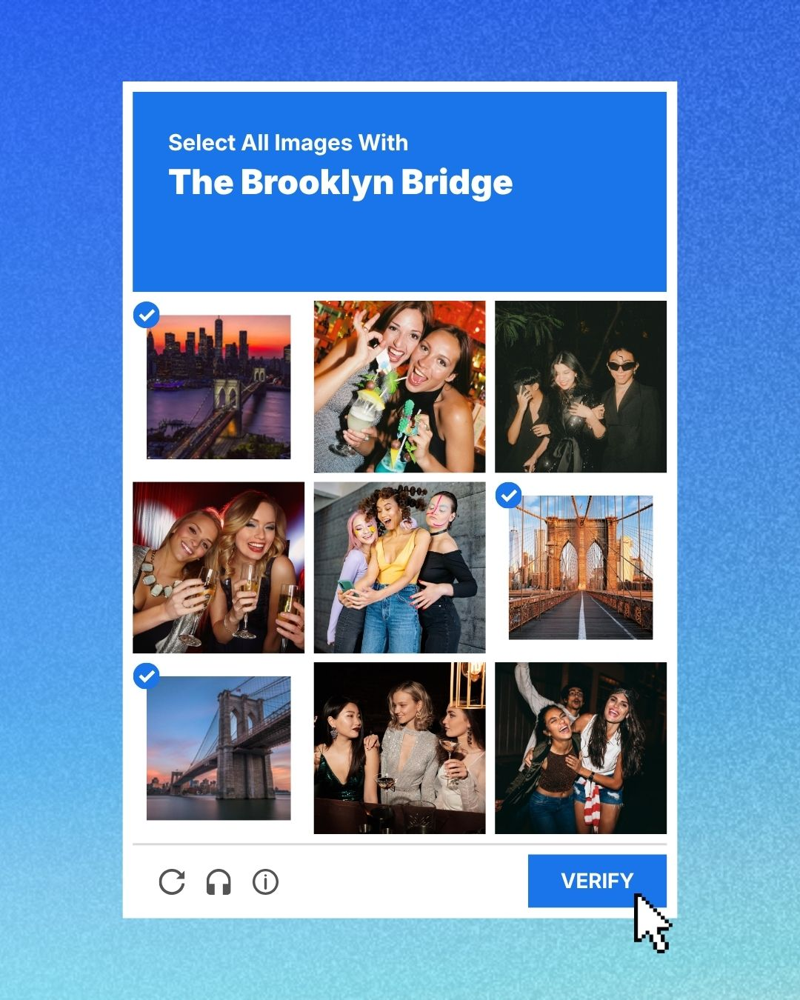

<!-- 在下面空行写第 48 件作品的注释；留空则不显示。 -->

</section>

<!-- WORK 49 / 搜索这个编号即可找到上传和注释位置。 -->
<section class="work" id="work-49" markdown="1">

<h2>49 / 50</h2>

  <strong>Brooklyn Bridge Terms &amp; Conditions</strong>  
  By crossing this bridge, you agree to: 
  □ Connect Brooklyn and Manhattan 
  □ Enjoy the view 
  □ Not complain about tourists 
  □ Accept occasional closure

<!-- 上传 49.jpg 到 50ways/assets/images 文件夹后，删除下面图片代码两侧的注释符号即可显示。

-->

<!-- 在下面空行写第 49 件作品的注释；留空则不显示。 -->

</section>

<!-- WORK 50 / 搜索这个编号即可找到上传和注释位置。 -->
<section class="work" id="work-50" markdown="1">

<h2>50 / 50</h2>

<!-- 上传 50.jpg 到 50ways/assets/images 文件夹后，删除下面图片代码两侧的注释符号即可显示。

-->
Delete “Brooklyn Bridge”?

This bridge connects Brooklyn and Manhattan.
This action cannot be undone.

Cancel　　Delete

<!-- 在下面空行写第 50 件作品的注释；留空则不显示。 -->

</section>
