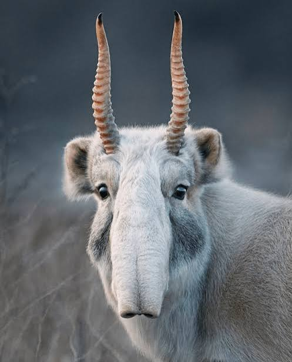
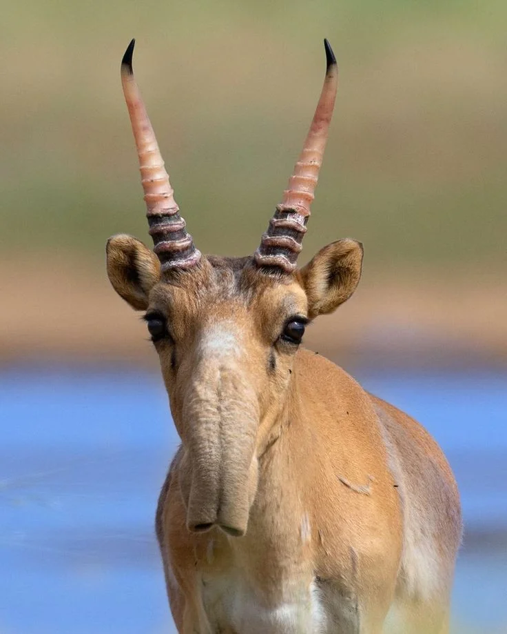
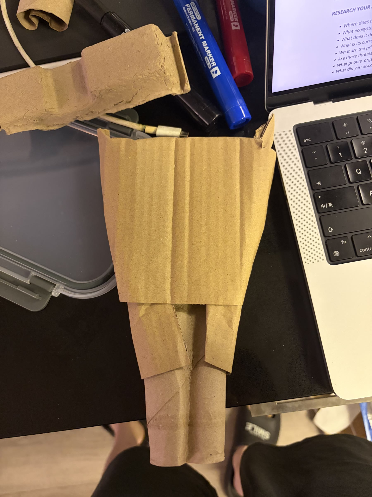
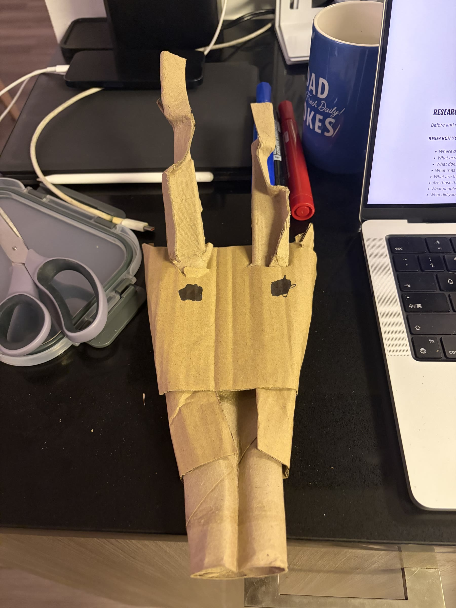

<!--
ADD NEW WORK HERE

1. Put images in endangered-animal/assets/images/
2. Copy the section below and remove the comment marks.
3. Change the number, image name, alt text, and notes.

<section class="work" id="work-01" markdown="1">
  
<h2>01</h2>

  
  

Write your notes here.
  

</section>
-->

<section class="work" id="original" markdown="1">

Original

  
  

When I saw the saiga antelope’s distinctive nose, I immediately wanted to recreate its form using the cardboard tube from the center of a toilet paper roll.

</section>

<section class="work" id="work-01" markdown="1">

<h2>01 / Process</h2>

Building the cardboard structure.

</section>

<section class="work" id="work-02" markdown="1">

<h2>02 / Process</h2>

Adding facial features and raised forms to the prototype.

</section>
