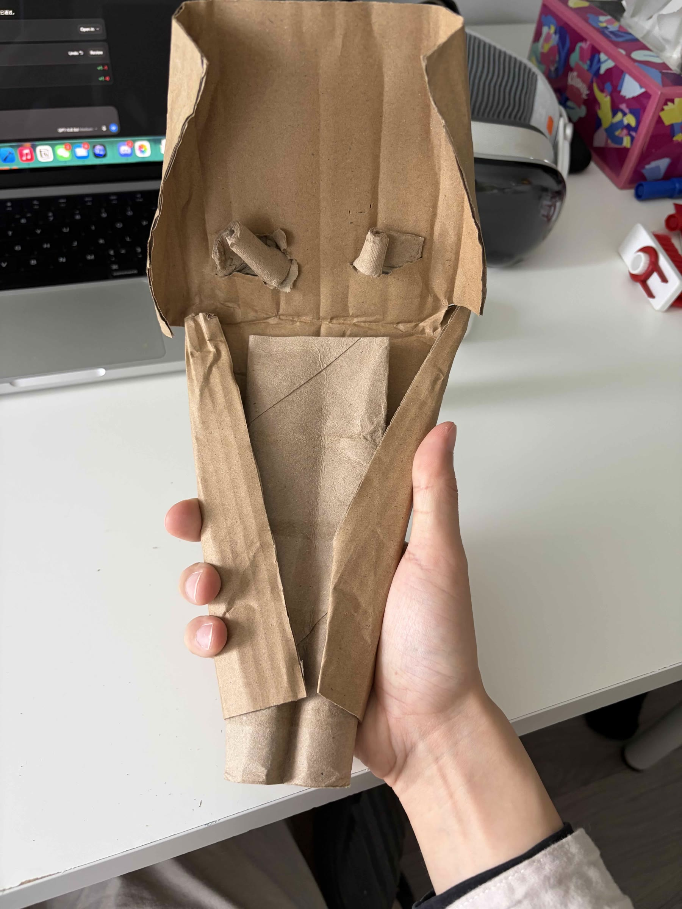
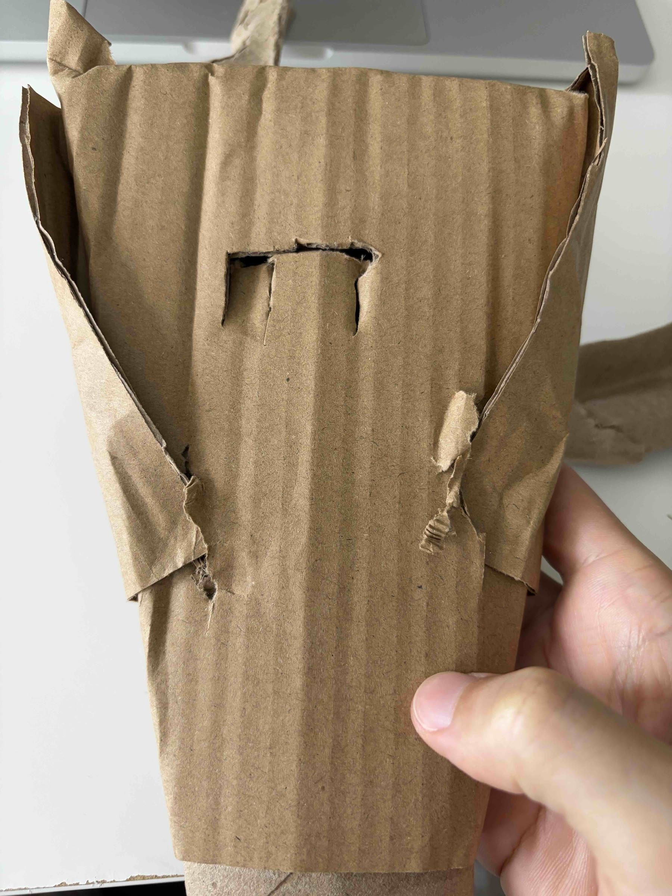
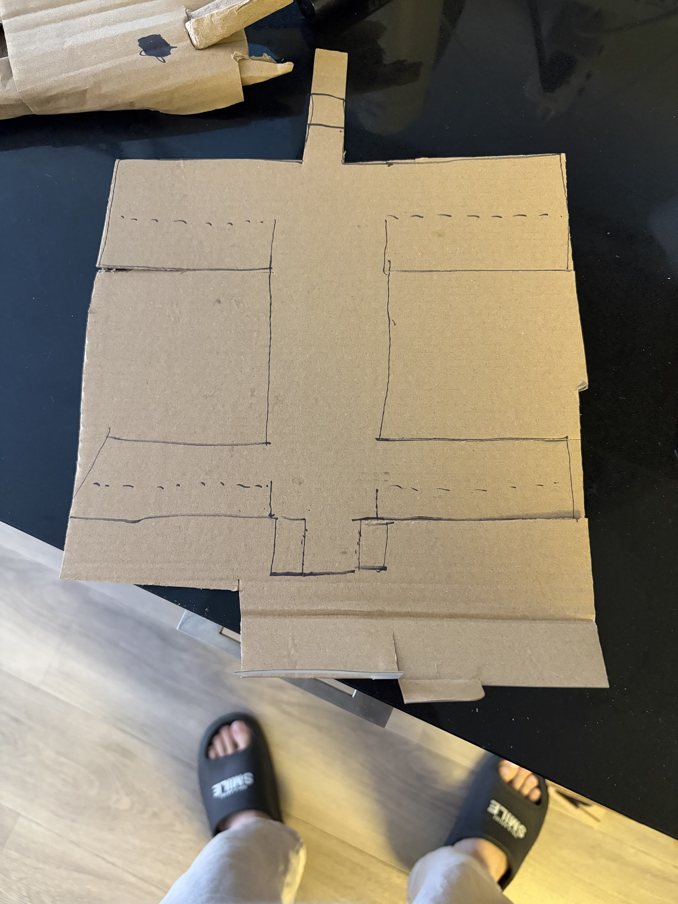
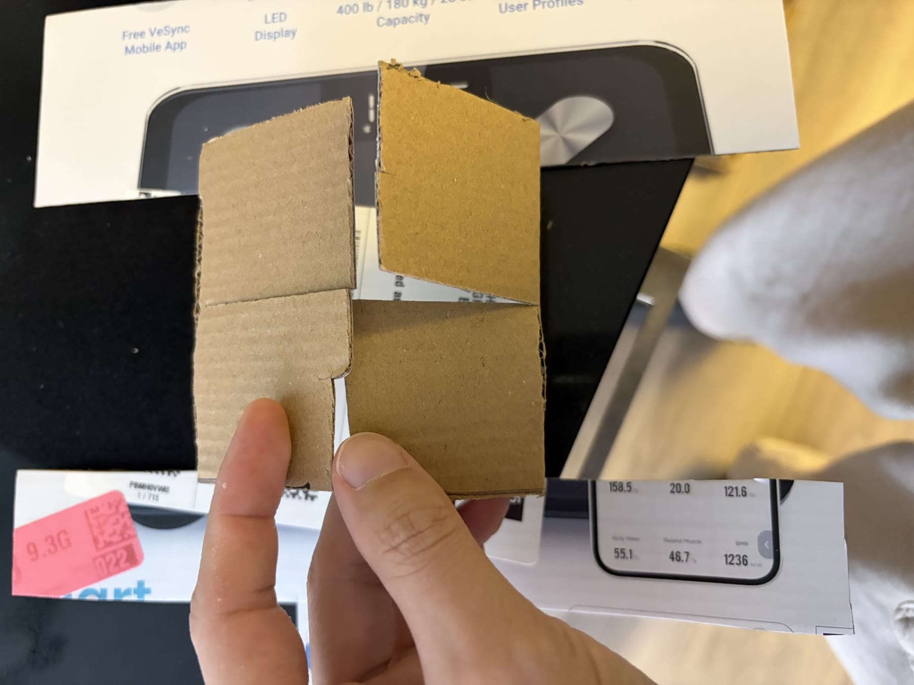
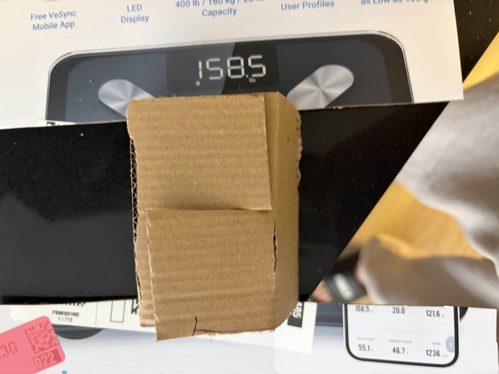
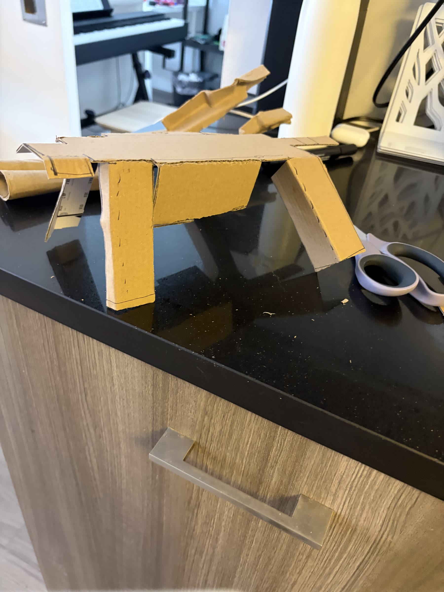
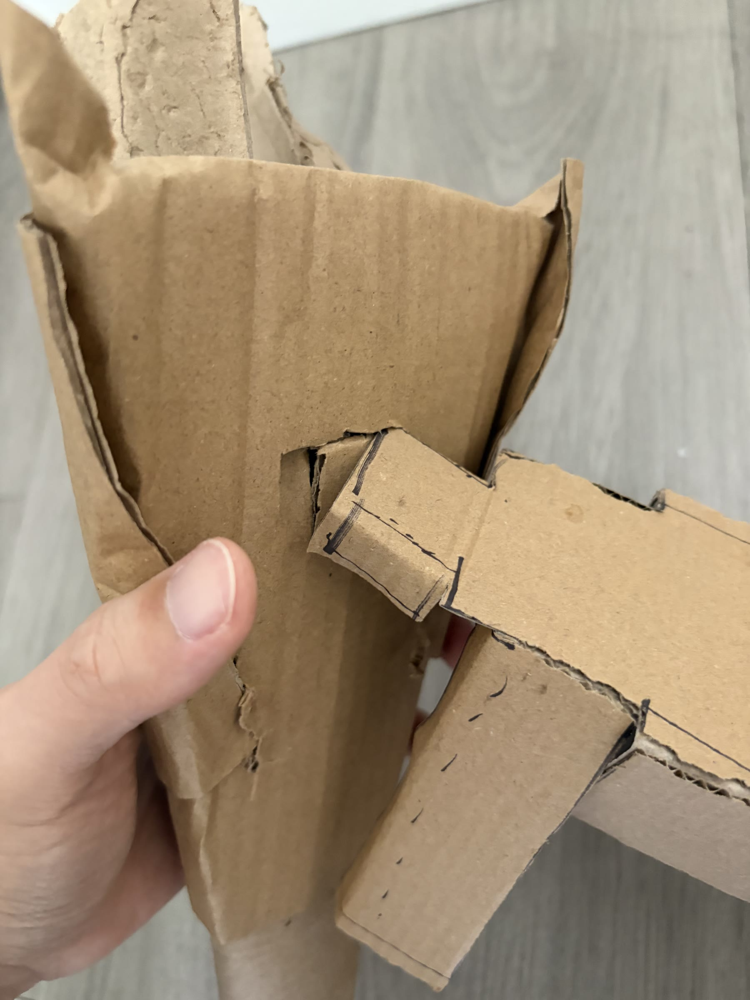
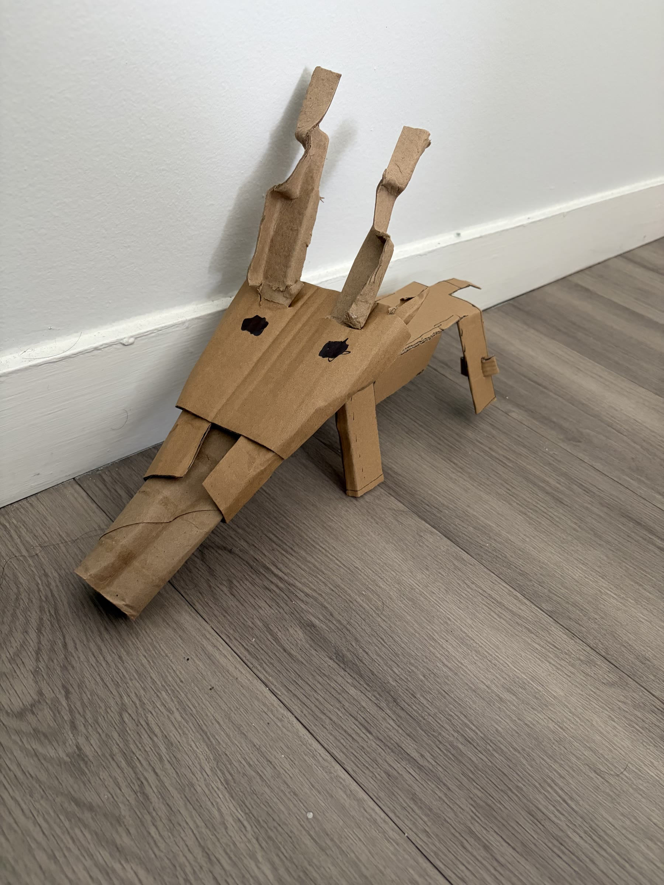
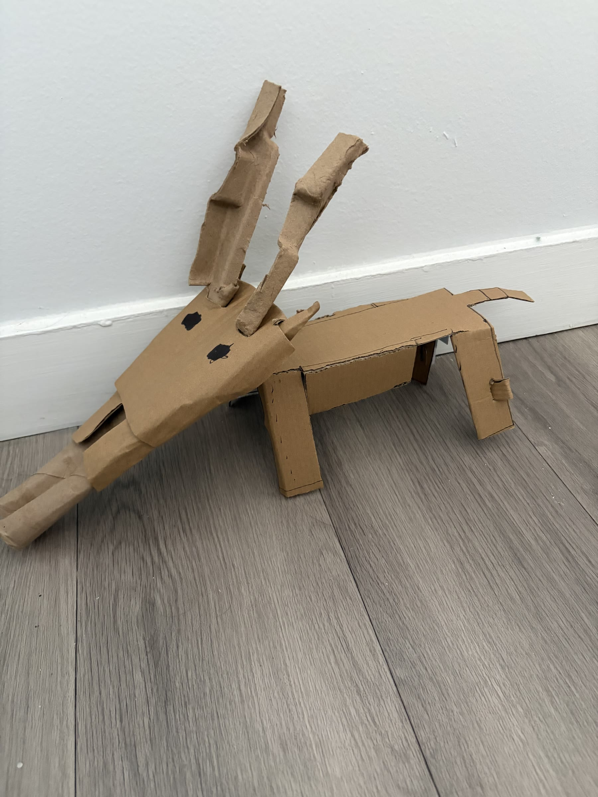

<!--
ADD NEW WORK HERE

1. Put images in endangered-animal/assets/images/
2. Copy the section below and remove the comment marks.
3. Change the number, image name, alt text, and notes.

<section class="work" id="work-01" markdown="1">
  
<h2>01</h2>

  
  

Write your notes here.
  

</section>
-->

<section class="work" id="original" markdown="1">

Original

  
  

When I saw the saiga antelope’s distinctive nose, I immediately wanted to recreate its form using the cardboard tube from the center of a toilet paper roll.

</section>

<section class="work" id="goal">

Goal

  
I realized that although I am using recycled materials to make an endangered animal, the process can still involve tape, glue, and other materials that are not truly sustainable. My goal for this project is to complete the entire piece without using any additional materials that are not recycled.

</section>

<section class="work" id="head" markdown="1">

<h2>Head</h2>

To avoid tape and glue, I designed every part to hold through folds, slots, and interlocking tabs. I first tested the joint at a small scale, then translated the same system into the body, legs, and head. The structure stays together through the tension and thickness of the recycled cardboard itself.

  

    <figure class="process-figure">
      
      <figcaption>01 — Shaping the head and nose.</figcaption>
    </figure>
    <figure class="process-figure">
      
      <figcaption>02 — Head, front view.</figcaption>
    </figure>
  

  

    <figure class="process-figure">
      
      <figcaption>03 — Folded supports inside the head.</figcaption>
    </figure>
    <figure class="process-figure">
      
      <figcaption>04 — The head secured by a locking tab.</figcaption>
    </figure>
  

</section>

<section class="work" id="body" markdown="1">

<h2>Body</h2>

  <figure class="process-figure process-figure--lead">
    
    <figcaption>05 — Drawing the cut-and-fold pattern for the body.</figcaption>
  </figure>

  

    <figure class="process-figure">
      
      <figcaption>06 — Testing two opposing slots.</figcaption>
    </figure>
    <figure class="process-figure">
      
      <figcaption>07 — The test joint locked into place.</figcaption>
    </figure>
  

  <figure class="process-figure process-figure--lead">
    
    <figcaption>08 — Body after folding.</figcaption>
  </figure>

  <figure class="process-figure process-figure--lead">
    
    <figcaption>09 — Connecting the head and body with a folded tab.</figcaption>
  </figure>

  

    <figure class="process-figure">
      
      <figcaption>10 — Completed prototype, front view.</figcaption>
    </figure>
    <figure class="process-figure">
      
      <figcaption>11 — Completed prototype, side view.</figcaption>
    </figure>
  

No tape or glue was used. Each connection is made from the recycled cardboard itself and can be taken apart without leaving adhesive behind.

</section>
