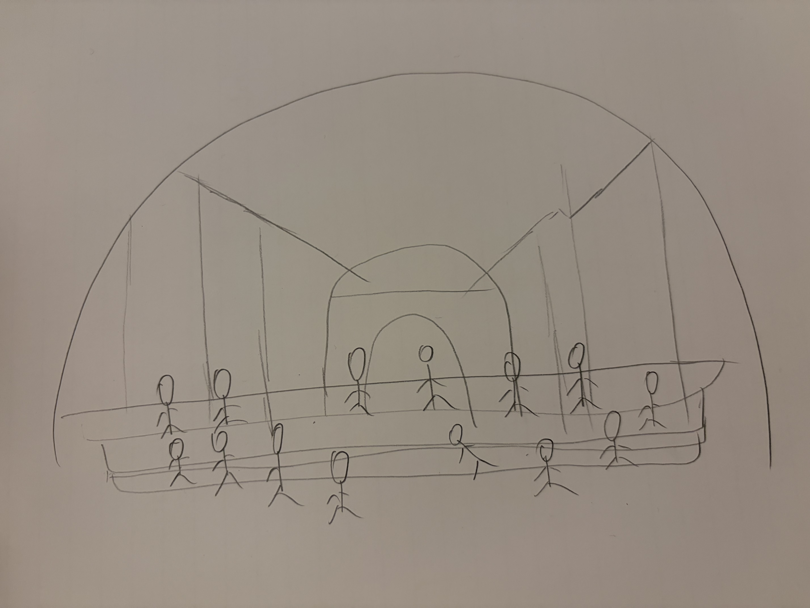
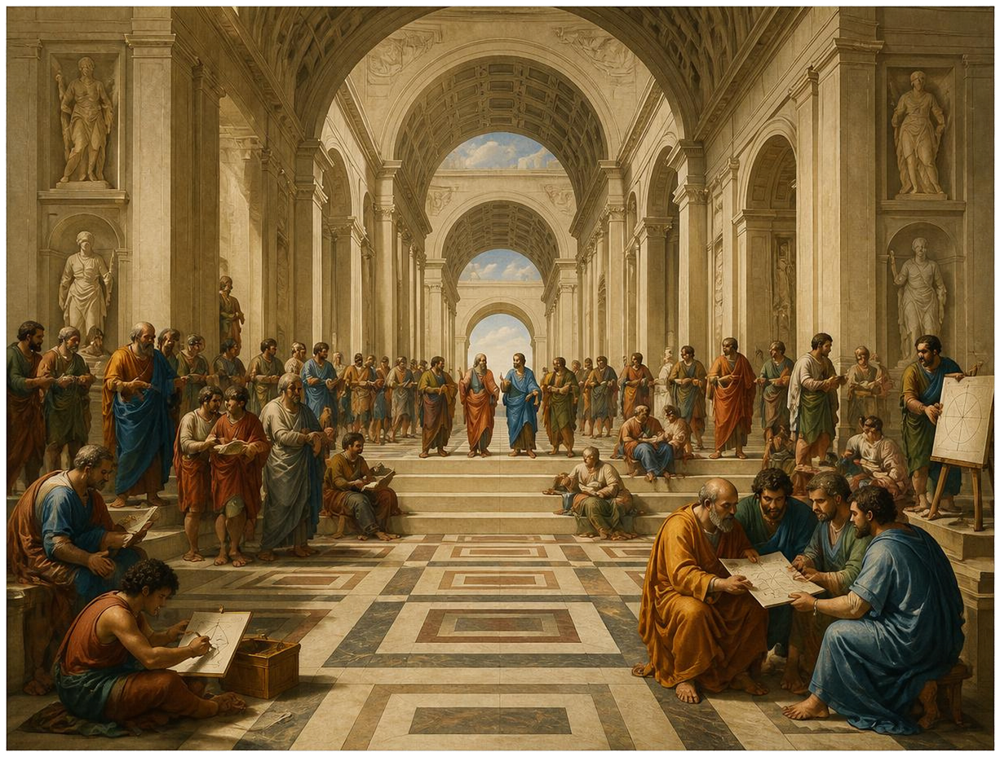
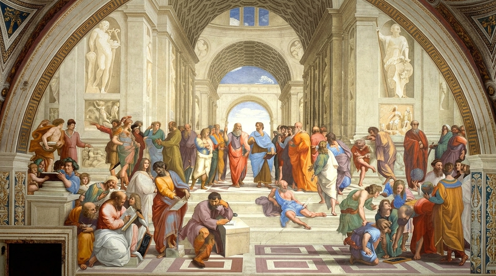
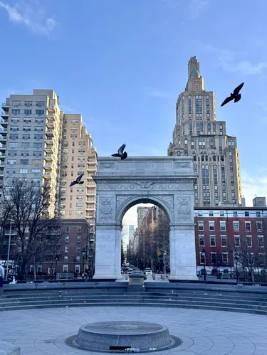
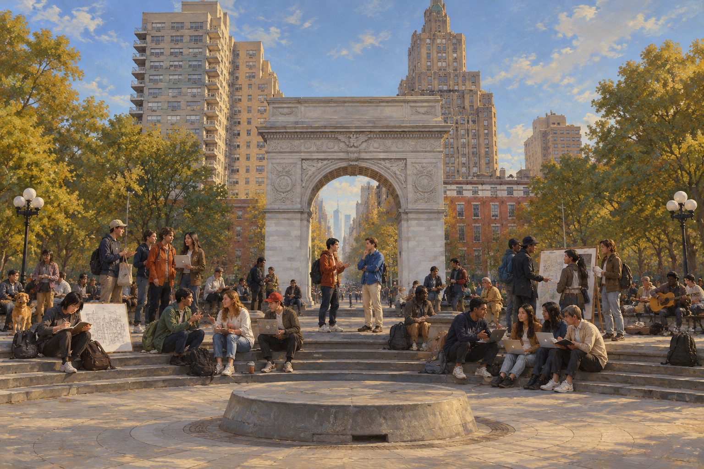
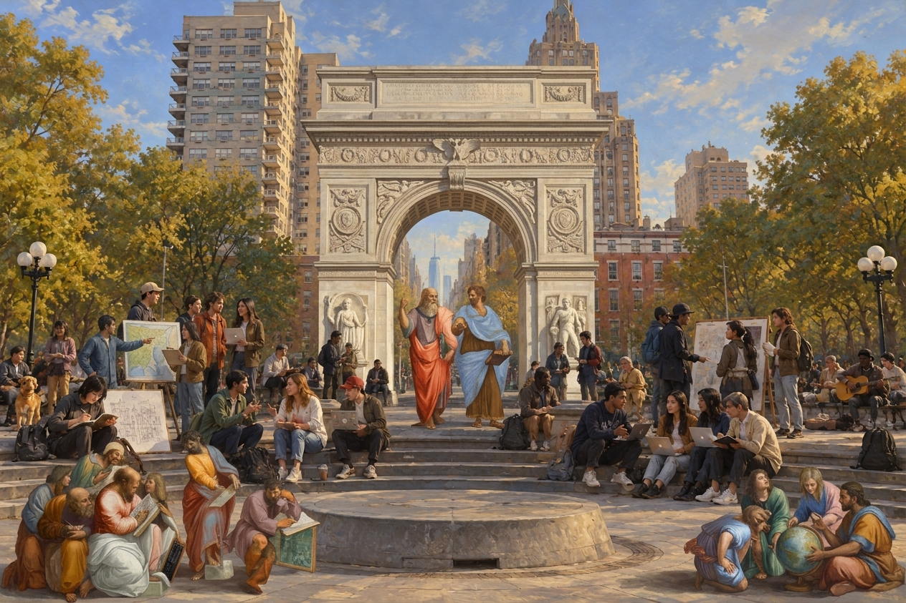
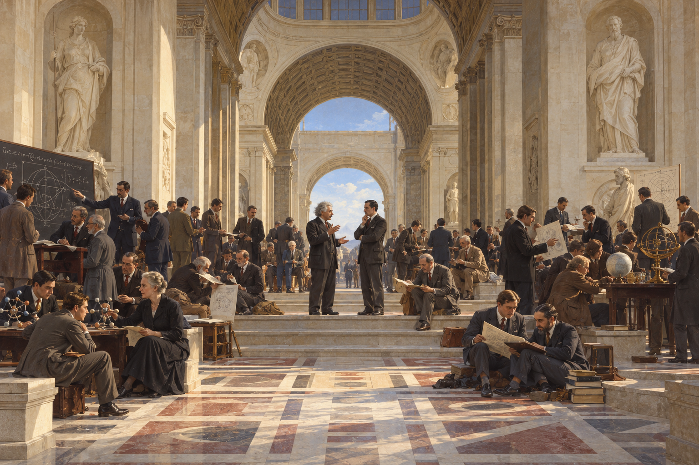
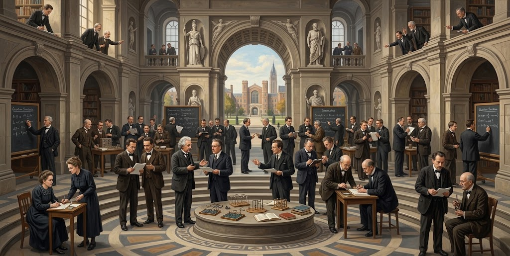
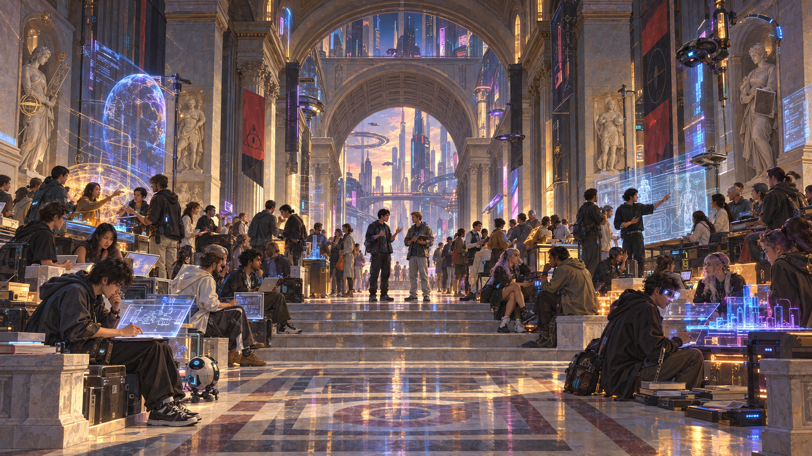
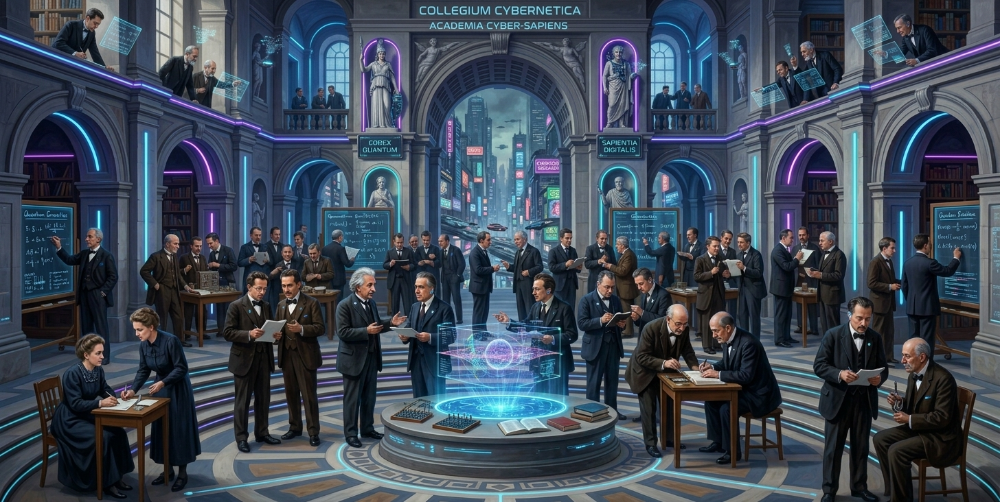

<figure class="process-figure process-figure--lead" id="original-artwork">
  
  <figcaption>Raphael, <em>The School of Athens</em> (c. 1509–1511)</figcaption>
</figure>

<aside class="artwork-reference" aria-label="Original artwork for comparison" hidden>
  

    Original work
    <button type="button" aria-expanded="true" aria-controls="artwork-reference-image">Hide</button>
  

  

    
    
Raphael, <em>The School of Athens</em>

  

  
  
  
  
  
  
  
  
</aside>

<section class="work" id="work-01" markdown="1">

<h2>01 Take an object</h2>

### STEP 1 — Public Domain

**Public Domain**

Raphael’s *The School of Athens* (c. 1509–1511) is in the public domain. Raphael died in 1520, more than five centuries ago, so the original artwork is no longer protected by copyright.

[Public-domain verification — Wikimedia Commons](https://commons.wikimedia.org/wiki/File:The_School_of_Athens_by_Raffaello_Sanzio_da_Urbino.jpg#Summary)

### STEP 2 — Context

**Historical Context**

Raphael created *The School of Athens* around 1509–1511 after moving to Rome to work for Pope Julius II. The fresco was painted in the Stanza della Segnatura in the Vatican Palace, a room originally used as the Pope’s private library and study. Its larger decorative program explored different forms of human thought, including theology, philosophy, poetry, and justice. *The School of Athens* represented philosophy, or rational truth.

[Room and historical context — Vatican Museums](https://www.museivaticani.va/content/museivaticani/en/collezioni/musei/stanze-di-raffaello/stanza-della-segnatura/stanza-della-segnatura.html)

Rather than depicting one historical event, Raphael brought together thinkers from different places and periods into one imagined architectural space. Plato and Aristotle occupy the center, while philosophers, mathematicians, and other intellectual figures form smaller groups around them. The work reflects the High Renaissance interest in classical antiquity, humanist thought, idealized architecture, and convincing representations of three-dimensional space.

The work is a fresco, meaning that Raphael worked directly into the architectural environment rather than producing an independent canvas. Its monumental architecture and carefully constructed illusion of depth make the painted space feel almost physically continuous with the viewer’s space.

[Artwork and figures — Vatican Museums](https://www.museivaticani.va/content/museivaticani/en/collezioni/musei/stanze-di-raffaello/stanza-della-segnatura/scuola-di-atene.html)

### STEP 3 — Why I Chose This Work

What first drew me to *The School of Athens* was its strong spatial geometry. The architecture, perspective, and arrangement of the figures create a very structured space, while at the same time the painting is filled with people and smaller interactions happening everywhere.

What makes this especially interesting to me is that these figures are not simply a crowd. They represent different philosophers, mathematicians, and thinkers, and together they embody different forms of knowledge accumulated by humanity up to that time. This combination of a strong spatial structure and a large number of figures carrying different meanings gives me a lot of material to work with. I can preserve the underlying geometry while changing who occupies the space, what kinds of knowledge they represent, or even how knowledge itself is visualized.

[Artwork reference — Vatican Museums](https://www.museivaticani.va/content/museivaticani/en/collezioni/musei/stanze-di-raffaello/stanza-della-segnatura/scuola-di-atene.html)

</section>

<section class="work" id="work-02" markdown="1">

<h2>02 DO something to it</h2>

### STEP 4 — Visual Analysis

- **Geometry / Perspective**  
  Strong one-point perspective organizes the entire composition. Most architectural lines converge toward the center of the image, where the two central figures are located.
- **Architecture**  
  Repeated arches, vaulted ceilings, columns, stairs, and geometric floor patterns create multiple layers of depth and give the space a monumental scale.
- **Central Figures**  
  Two figures occupy the visual center of the composition. Their placement along the central perspective axis makes them the main visual anchor among a very large number of people.
- **Human Clusters**  
  The figures are not arranged as one uniform crowd. Instead, they form many smaller groups distributed throughout the space, each with its own activity and interaction.
- **Gestures / Relationships**  
  People are discussing, reading, writing, teaching, observing, and drawing. Their gestures and gazes establish relationships within each group and help distinguish different activities.
- **Foreground / Background**  
  The foreground is relatively open and contains several separated groups, while the middle ground becomes much denser. The architecture continues far into the background, strengthening the sense of depth.
- **Symmetry + Disorder**  
  The architecture is highly symmetrical and geometrically ordered, while the people are arranged more organically and asymmetrically. This creates a contrast between a rigid spatial framework and complex human activity.
- **Color**  
  The architecture is dominated by relatively neutral stone colors, while the figures introduce stronger reds, blues, greens, oranges, and other colors throughout the composition.
- **Main Quality I Want to Preserve**  
  **Geometric order + human complexity.** The highly controlled architectural space contains many independent people, activities, and relationships without making the overall composition feel chaotic.

#### Initial Text Prompt {#initial-text-prompt}

> Create a wide-format painted scene of a monumental architectural interior containing many people engaged in different forms of intellectual activity. Use strong one-point perspective, with the main architectural lines converging toward a central vanishing point between two standing figures. These two figures form the main visual anchor, but they remain part of a larger network of interactions.
>
> Organize the architecture symmetrically around this central axis. Repeated arches, vaulted ceilings, columns, broad stairs, and geometric floor patterns should establish successive layers of depth. The space should extend far into the background and feel monumental in relation to the people.
>
> Arrange the people organically and asymmetrically within this ordered framework. They should form distinct clusters of different sizes and densities rather than a uniform crowd. Some discuss ideas face to face, others read or write, and others teach, observe, or draw geometric diagrams. Use varied poses, gestures, and directions of gaze to make the relationships within each group visible. Keep the foreground relatively open, with separated groups and clear spaces between them, while the middle ground becomes denser.
>
> Use relatively neutral stone colors for the architecture. Distribute stronger reds, blues, greens, and oranges across the figures to distinguish individuals and groups without overpowering the spatial structure.
>
> The central quality to preserve is **geometric order combined with human complexity**: a controlled, coherent architectural space containing many independent activities and relationships. Represent knowledge through these interactions and practices rather than through a single symbolic object.

### STEP 5 — Analytical Sketch {#analytical-sketch}

<figure class="process-figure process-figure--lead">
  
  <figcaption>My analytical sketch</figcaption>
</figure>

### STEP 6 — Initial GenAI Results

  <figure class="process-figure">
    
    <figcaption>GPT · 5.6sol</figcaption>
  </figure>
  <figure class="process-figure">
    
    <figcaption>Canva</figcaption>
  </figure>
  <figure class="process-figure">
    
    <figcaption>Gemini</figcaption>
  </figure>

### STEP 7 — Results Analysis

What surprised me most was how similar the people were across all three results. I never named any philosophers in my prompt, and my rough sketch only showed simplified figures. Yet every AI produced a scene that closely resembled *The School of Athens*, including two central figures resembling Plato and Aristotle. The clothing, gestures, and surrounding groups also felt remarkably familiar.

I had described the geometry, architecture, and relationships between people, but had not specified who those people should be. Seeing all three systems arrive at such a similar interpretation was almost unbelievable. It made me wonder whether the combination of these visual cues led them toward a familiar representation of the painting, rather than a new interpretation of the structure I described.

</section>

<section class="work" id="work-03" markdown="1">

<h2>03 DO SOMETHING <em>ELSE</em> TO IT</h2>

For the next iteration, I chose to move the scene to Washington Square Park, a place connected to my everyday life at NYU. The arch and surrounding plaza became a new setting for the gathering of people and exchange of knowledge.

<figure class="process-figure process-figure--lead">
  
  <figcaption>Washington Square Park — setting reference</figcaption>
</figure>

  <figure class="process-figure">
    
    <figcaption>GPT</figcaption>
  </figure>
  <figure class="process-figure">
    
    <figcaption>Gemini</figcaption>
  </figure>

Both results use the Washington Square arch as the central spatial anchor, with smaller groups gathered around the plaza. However, they respond differently to the change of setting. GPT replaces the classical figures with people in contemporary clothing, using laptops, drawings, and a guitar to suggest different activities. Gemini mixes contemporary people with figures resembling those in *The School of Athens*, including the central pair in classical robes and several foreground groups.

Changing the location did not fully remove the original painting’s visual conventions. The central pair and surrounding clusters remain recognizable in both images, while Gemini carries more of the original figures into the new setting. This makes the difference clear: one result updates the gathering for a contemporary place, while the other brings the historical gathering into that place.

</section>

<section class="work" id="work-04" markdown="1">

<h2>04 REPEAT</h2>

### Iteration 1 — Solvay Conference

> Reimagine the previous scene using the 1927 Solvay Conference as a reference. Replace the ancient thinkers with early 20th-century scientists, but keep the monumental architecture, strong central perspective, and groups of people exchanging knowledge. Instead of posing for a photograph, show the scientists actively discussing, writing, calculating, teaching, and sharing ideas in small groups.

<figure class="process-figure process-figure--lead">
  
  <figcaption>1927 Solvay Conference — reference</figcaption>
</figure>

  <figure class="process-figure">
    
    <figcaption>GPT</figcaption>
  </figure>
  <figure class="process-figure">
    
    <figcaption>Gemini</figcaption>
  </figure>

GPT keeps a vaulted hall and two central speakers, while Gemini reorganizes the gathering around tables in a multi-level interior. Both use suits, papers, blackboards, and scientific equipment to represent the new context, turning the posed group reference into smaller scenes of discussion and work.

### Iteration 2 — Cyberpunk Future

> Reimagine the scene in a cyberpunk future. Keep the monumental architecture, central perspective, and groups exchanging knowledge, but add futuristic technology, holographic interfaces, neon lights, and a cyberpunk city visible in the background. Keep the painted style.

  <figure class="process-figure">
    
    <figcaption>GPT</figcaption>
  </figure>
  <figure class="process-figure">
    
    <figcaption>Gemini</figcaption>
  </figure>

GPT changes the people into a younger-looking, casually dressed gathering and fills the hall with digital workstations, robots, and holograms. Gemini retains much more of its previous scene: the suited scientists, tables, and figure placements remain similar, while neon outlines, floating interfaces, and a futuristic skyline are added around them. The same prompt produces a broader reinterpretation in one result and a more direct visual modification in the other.

</section>

<section class="work" id="work-05" markdown="1">

<h2>05 Reflection</h2>

#### GenAI Summary

I began with the relationship between geometric order and human complexity in *The School of Athens*. Across the iterations, the systems consistently preserved a central axis, monumental arches, and clusters of people. What surprised me most was that the first outputs resembled the original painting even though I had not named its figures. My description seemed to lead the systems toward a familiar visual interpretation rather than an entirely new gathering.

The changes of setting and period made the systems’ conventions easier to see. Knowledge appeared through books, papers, blackboards, laptops, and eventually holograms. These objects made the theme recognizable, but did not necessarily make the exchanges meaningful. It was easier to obtain a convincing atmosphere than to control exactly who was present or what each person was communicating. Ancient robes in the park, added robots in the future, and decorative interface text show where the systems carried over familiar imagery or supplied details I had not specified.

#### Model Comparison

The first round included GPT, Canva, and Gemini; the later comparisons used GPT and Gemini. Canva’s first result also stayed close to the classical architectural setting, but one output is not enough to judge its flexibility across iterations. GPT made larger changes to the people and activities in the park and cyberpunk scenes. Gemini’s retention of classical figures in the park was particularly unexpected, and its cyberpunk result preserved more of the preceding scientists and layout.

In these examples, Gemini’s continuity could be useful when I wanted to retain an existing arrangement, while GPT’s broader changes could be useful when I wanted a new interpretation. That does not establish which tool gives the most control overall. The recorded results also do not establish which required the most prompting. Both followed parts of the language closely, but relied on familiar visual conventions. Changing the prompts substantially changed the setting, clothing, and technology, while the underlying gathering remained recognizable.

#### Creative Decisions and Ownership

My decisions were the original reference, the analytical sketch, the spatial qualities to preserve, and the shifts toward Washington Square Park, the Solvay Conference, and a cyberpunk future. The systems supplied most of the detailed appearances, gestures, objects, and lighting. I could make exact choices about individual identities and relationships more directly through drawing or collage; the AI helped me compare possible directions and notice how persistently the central pair and surrounding groups organize the scene.

The images are AI-generated, with a process directed by my references and prompts. I see my authorship in those choices and comparisons, while acknowledging that I did not manually produce the final images. At this point, the comparison between continuity and transformation provides a useful place to pause: the futuristic surfaces have changed dramatically, but the image still organizes knowledge around people gathered in a monumental space.

</section>
