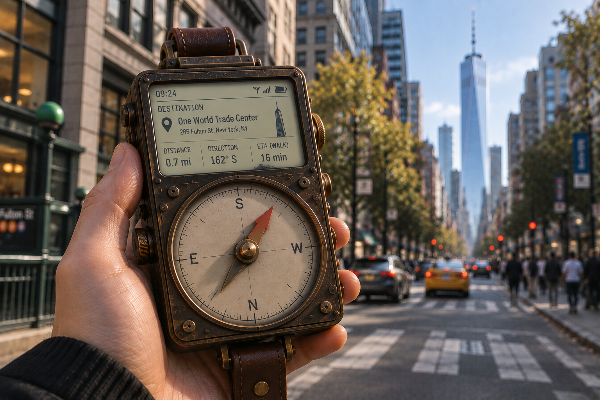
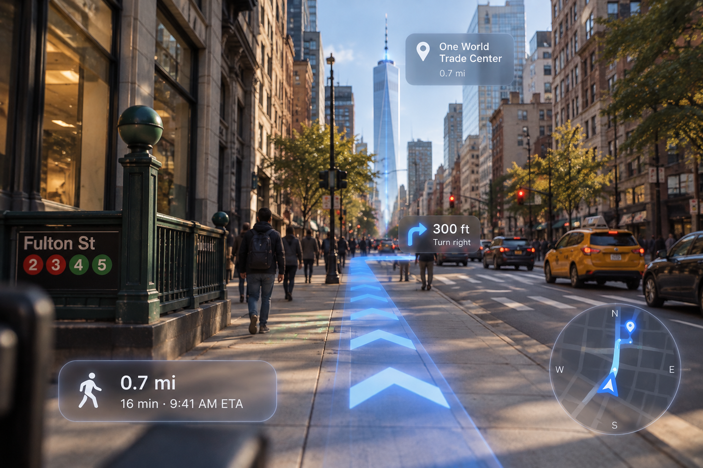
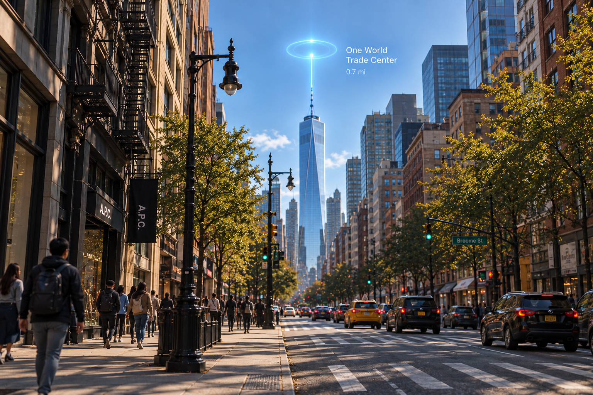
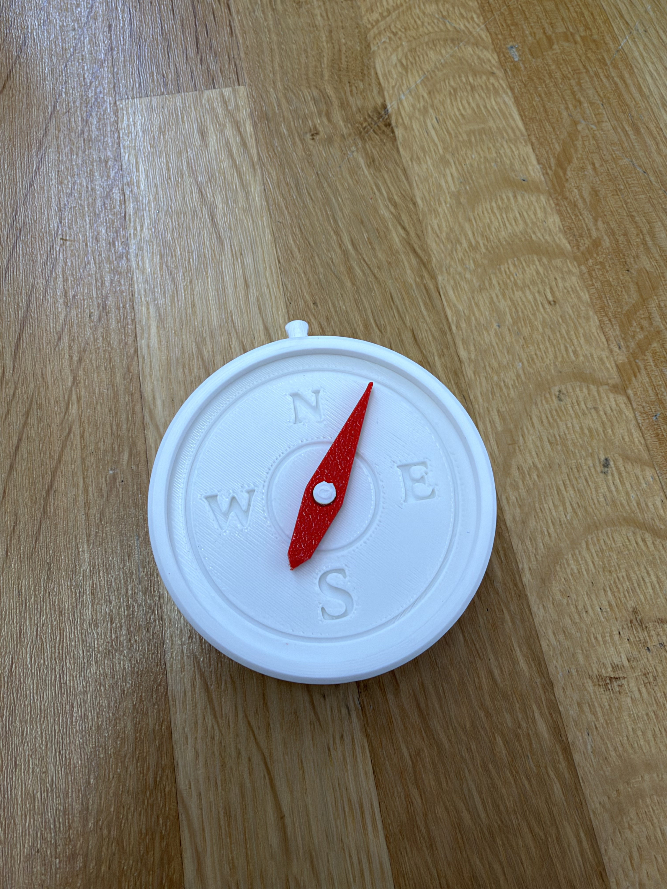
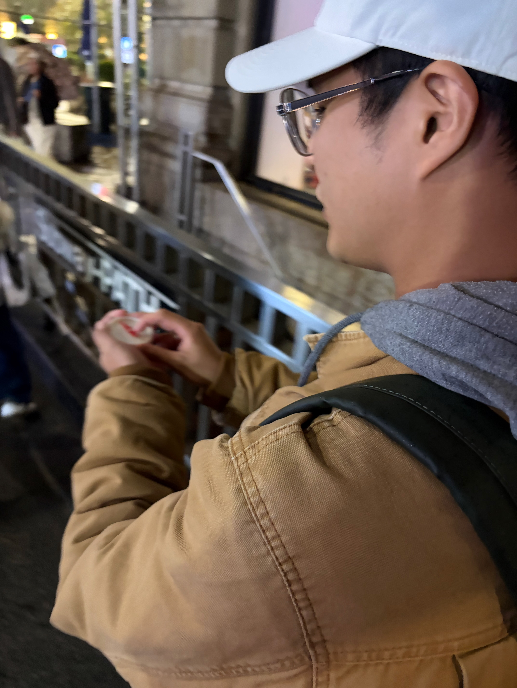
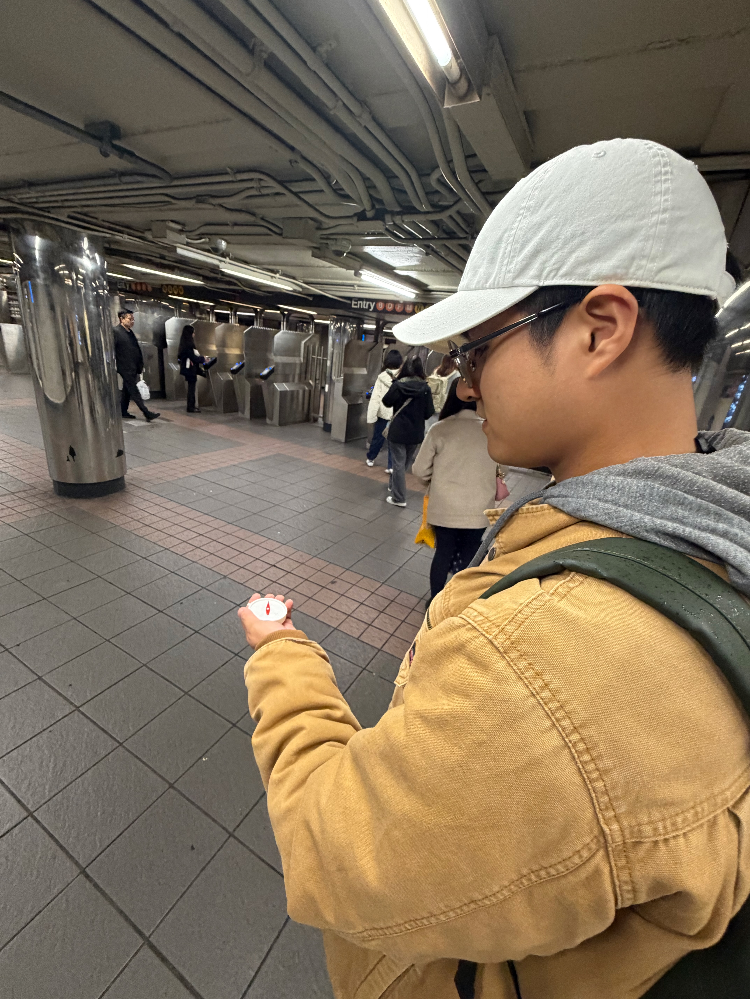

<!-- 确认周次后，将上方 week 改为对应的 Week 编号。 -->

<section class="work" id="work-01" markdown="1">

<h2>01 Choose &amp; Analyze — Google Maps</h2>

<!-- 将图片放入 playful-interfaces/assets/images/，更新文件名和描述后取消注释：

-->

Google Maps is one of the digital tools I use most often, especially since moving to New York. While it is usually efficient and reliable, I have recently become more aware of some limitations in how it communicates direction and space.

The compass and orientation sometimes update too slowly, making it difficult to tell which direction I should start walking. The 2D map also becomes confusing in multi-level environments, where paths that appear connected on screen may actually exist on different floors.

These frustrations made me interested in exploring navigation beyond a flat map and turn-by-turn instructions.

</section>

<section class="work" id="work-02" markdown="1">

<h2>02 “We Need to Talk” Letter</h2>

Dear Google Maps,

I rely on you almost every day. You’ve taken me through unfamiliar streets, subway stations, and places I probably would have gotten lost in on my own.

But sometimes, I really wish you understood where I am as well as you claim to.

I hate standing at an intersection, turning myself around while waiting for your compass to finally decide which way I’m facing. And when I’m inside a station, mall, or multi-level building, your flat map can make me feel even more lost. You show me where I am, but not always *where I am in space*.

Maybe I don’t need more instructions from you. Maybe I just need a better sense of where I’m trying to go.

</section>

<section class="work" id="work-03" markdown="1">

<h2>03 Three Concepts</h2>

### **01 — Compass**

Instead of showing a route, a handheld compass always points directly toward the destination. It tells me **where to go, but not how to get there**, leaving the actual path for me to discover.

### **02 — AR Navigation**

Instead of translating the world into a 2D map, navigation appears directly in the physical environment. Directions, turns, and paths are overlaid onto the streets and spaces where they actually exist, making navigation easier to understand spatially.

This concept was inspired by the Forza Horizon series, which made me think about how navigation could feel more directly connected to the environment.

<figure class="process-figure">
  
  <figcaption>Game inspiration — Forza Horizon series</figcaption>
</figure>

### **03 — Beacon**

A virtual beacon is placed above the destination and remains visible from a distance. There is no suggested route or turn-by-turn instruction—the beacon only tells me **where the destination is**, while I decide how to reach it.

This concept was inspired by Elden Ring and the idea of using a distant visual marker to guide exploration while leaving the path open to discovery.

<figure class="process-figure">
  
  <figcaption>Game inspiration — Elden Ring</figcaption>
</figure>

</section>

<section class="work" id="work-04" markdown="1">

<h2>04 Prototype</h2>

I created the prototype’s shell using 3D printing. At this stage, it is a physical model without any built-in smart functionality.

For user testing, I plan to use a **Wizard-of-Oz** approach: I will manually simulate the intended functionality so participants can try the interaction before the technology is implemented.

</section>

<section class="work" id="work-05" markdown="1">

<h2>05 User Testing</h2>

  
  

The participant found it fun to navigate by following the compass. Without being able to see the final destination, they became more curious about the people, places, and things around them. Rather than focusing only on getting somewhere, they paid more attention to their surroundings along the way.

</section>

<section class="work" id="work-06" markdown="1">

<h2>06 Reflection</h2>

<!-- 在这里填写项目反思与下一步计划。 -->

</section>
