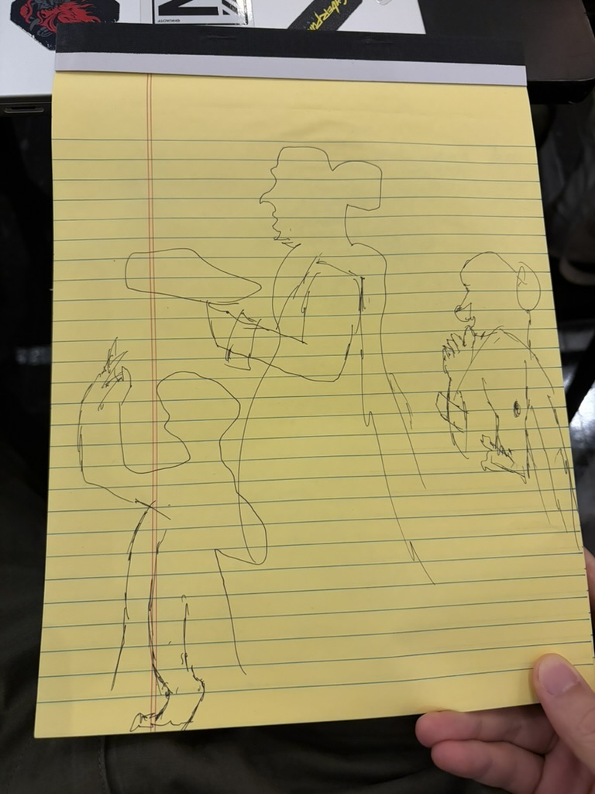
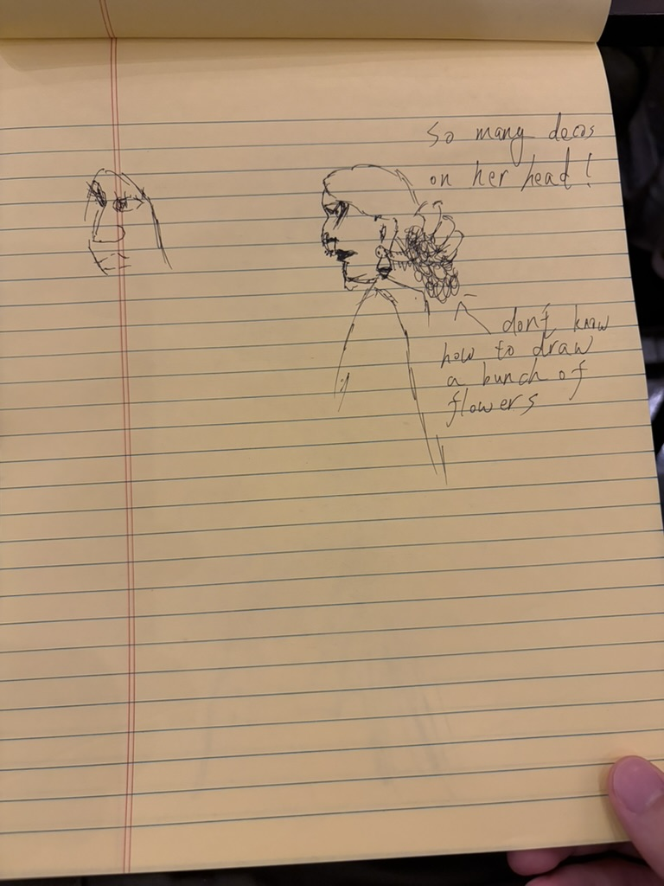
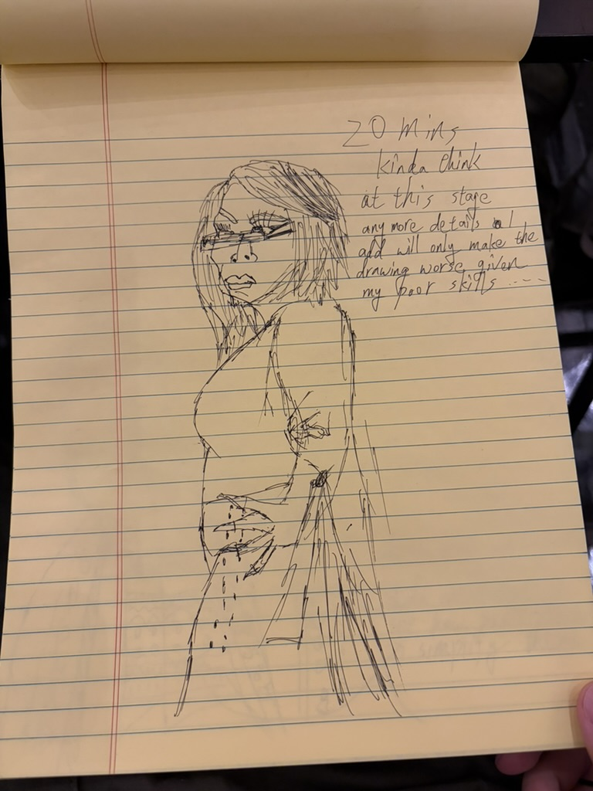
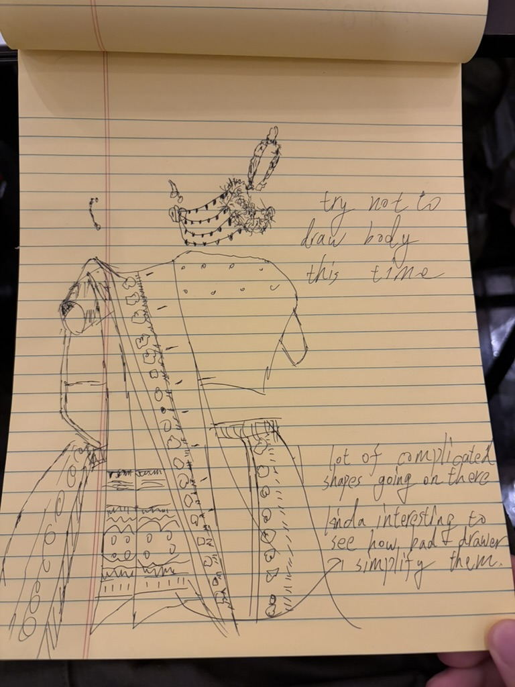
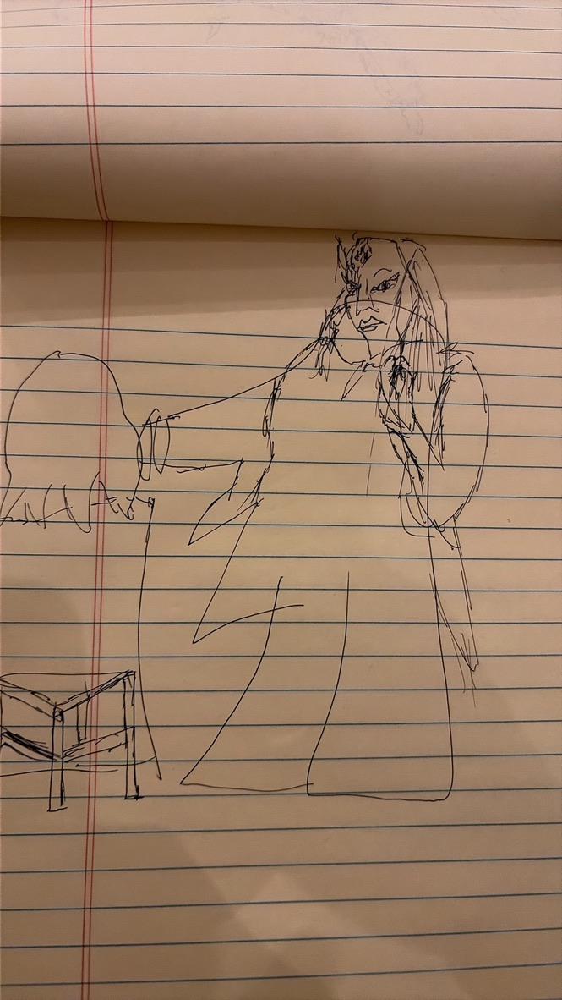
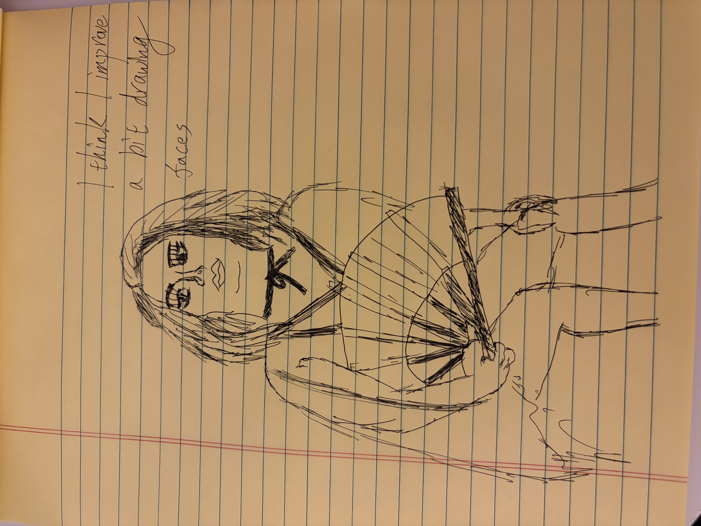

Six sketches from class, with a few notes on what I found difficult and what improved.

<section class="work" id="work-01" markdown="1">

<h2>01 Gesture and outline</h2>

With limited time, I tried to roughly outline the three poses.

</section>

<section class="work" id="work-02" markdown="1">

<h2>02 Too many details</h2>

I found the intricate flowers really hard to draw and had no idea how to approach them. I spent most of the time drawing the face, then ran out of time.

</section>

<section class="work" id="work-03" markdown="1">

<h2>03 Knowing when to stop</h2>

After twenty minutes, I felt that adding more details might make the drawing worse. At the time, I blamed my drawing skills, but looking back, the question is also about what the drawing still needs. The eyes and hair already have strong marks, while the body is described more loosely. Adding equally heavy detail everywhere could make it harder to see what matters. Before adding another line, I could pause and ask whether it clarifies the form or just fills space. Knowing when to stop is something I want to practice too.

</section>

<section class="work" id="work-04" markdown="1">

<h2>04 Drawing the clothes</h2>

For this sketch, I decided to try leaving out the body and focus on the clothes and accessories. There were a lot of complicated shapes, and I thought it was interesting to see how my limited drawing skills simplified them. The patterns became repeated circles, short lines, and zigzags, while the edges of the fabric carried the larger shapes. This makes me think that simplification can be a useful choice, even when it begins with not knowing how to draw something. Next time, I would pay more attention to the direction of the folds so the patterns feel connected to the fabric.

</section>

<section class="work" id="work-05" markdown="1">

<h2>05 The whole pose</h2>

I tried starting with the overall outline instead of spending too much time on the face right away, only to realize I had already got the outline wrong from the start, haha.

</section>

<section class="work" id="work-06" markdown="1">

<h2>06 A little more confidence</h2>

I wrote that I thought I had improved a bit at drawing faces. Compared with the earlier sketches, the eyes, nose, and mouth feel more clearly placed within the outline of the head. There are still proportions I would adjust, but I can see why this drawing felt like progress. The fan also gives the composition a strong shape, with repeated lines spreading out from one point. My next challenge is to give the hands and body the same attention as the face, so the whole figure feels more connected.

</section>

<section class="reflection-conclusion" aria-labelledby="reflection-heading" markdown="1">

## Looking back

The biggest lesson from these sketches is that I do not need to solve every detail at once. The flowers and costume made me think about simplifying complicated forms, while the twenty-minute drawing raised the question of when extra marks stop helping. By the last sketch, I could recognize a small improvement in the faces. In the next session, I want to begin with the overall pose and proportions, choose a few details to focus on, and pause occasionally to look at the drawing as a whole.

</section>
